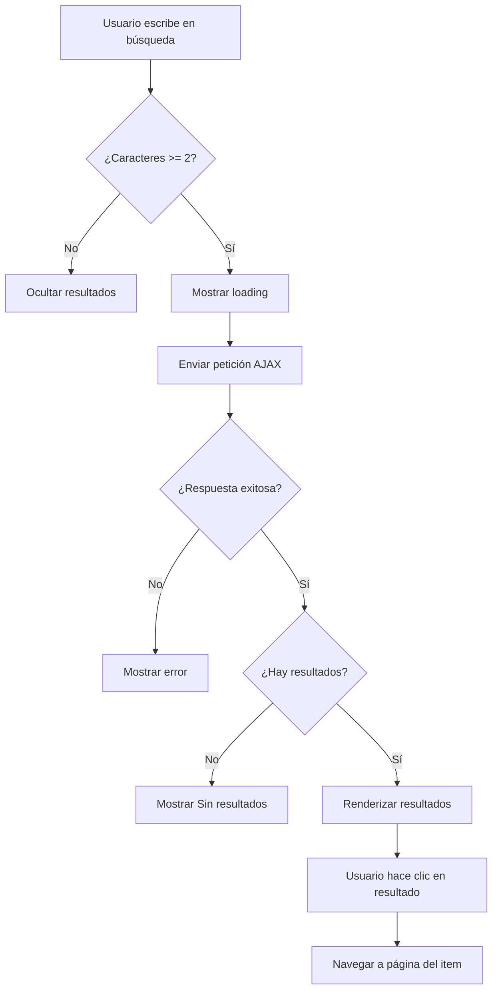

# Plan de Reconstrucción de la Barra de Búsqueda en el Navbar

## 📋 Análisis del Estado Actual

### Archivos Involucrados
1. **`resources/views/layouts/head.blade.php`** - Navbar con barra de búsqueda
2. **`app/Http/Controllers/SearchController.php`** - Controlador de búsqueda
3. **`resources/js/ui-interactions.js`** - JavaScript para búsqueda AJAX
4. **`routes/web.php`** - Ruta de búsqueda

### 🔴 Problemas Identificados

#### 1. **Búsqueda Móvil No Funciona**
- **Ubicación**: `head.blade.php` líneas 207-215
- **Problema**: El input móvil `global-search-input-mobile` NO está inicializado en el JavaScript
- **Impacto**: Los usuarios en dispositivos móviles no pueden usar la búsqueda

#### 2. **Incompatibilidad de Formato de Respuesta**
- **Controlador** (`SearchController.php` línea 74):
  ```php
  return response()->json(['results' => $results]);
  // Formato: { results: [{ type, icon, label, url }] }
  ```
- **JavaScript** (`ui-interactions.js` línea 90):
  ```javascript
  if (data.length === 0) { ... }
  // Espera: [{ type, title, subtitle, url }]
  ```
- **Problema**: El JavaScript espera un array directo, pero el controlador devuelve un objeto con propiedad `results`

#### 3. **Campos de Datos Incompatibles**
- **Controlador** devuelve: `label` (línea 33, 44, 55, 67)
- **JavaScript** espera: `title` y `subtitle` (líneas 100-101)
- **Problema**: Los nombres de campos no coinciden

#### 4. **Íconos Hardcoded en JavaScript**
- **JavaScript** (`ui-interactions.js` línea 95):
  ```javascript
  const icon = item.type === 'bien' ? '📦' : (item.type === 'usuario' ? '👤' : '🏢');
  ```
- **Controlador** ya devuelve el ícono en cada resultado
- **Problema**: Redundancia y limitación a solo 3 tipos

#### 5. **Falta Meta Tag para Ruta de Búsqueda**
- **JavaScript** (`ui-interactions.js` línea 80):
  ```javascript
  const searchUrl = document.querySelector('meta[name="search-route"]')?.content || '/buscar';
  ```
- **Problema**: No existe el meta tag `search-route` en los layouts, usa fallback hardcodeado

---

## 🎯 Plan de Reconstrucción

### Fase 1: Corregir el Controlador de Búsqueda
**Archivo**: `app/Http/Controllers/SearchController.php`

**Cambios**:
1. Modificar formato de respuesta para que sea compatible con el JavaScript
2. Estandarizar campos: usar `title` y `subtitle` en lugar de `label`
3. Mantener el ícono que ya devuelve el controlador

**Resultado esperado**:
```php
return response()->json($results);
// Formato: [{ type, icon, title, subtitle, url }]
```

### Fase 2: Actualizar el JavaScript de Búsqueda
**Archivo**: `resources/js/ui-interactions.js`

**Cambios**:
1. Inicializar búsqueda móvil además de la de desktop
2. Corregir manejo de respuesta del controlador
3. Usar íconos que vienen del controlador en lugar de hardcodearlos
4. Mejorar manejo de errores
5. Agregar indicador de carga (loading state)

**Resultado esperado**:
- Búsqueda funcional en desktop y móvil
- Manejo correcto de la respuesta JSON
- Mejor experiencia de usuario con loading state

### Fase 3: Agregar Meta Tag de Ruta de Búsqueda
**Archivos**: 
- `resources/views/layouts/app.blade.php`
- `resources/views/layouts/base.blade.php`

**Cambios**:
1. Agregar meta tag con la ruta de búsqueda:
```html
<meta name="search-route" content="{{ route('buscar.global') }}">
```

### Fase 4: Mejoras Opcionales (UX)
**Archivo**: `resources/views/layouts/head.blade.php`

**Posibles mejoras**:
1. Agregar atajo de teclado (Ctrl+K o /) para enfocar búsqueda
2. Mejorar indicador visual de resultados
3. Agregar categorías/secciones en resultados
4. Mostrar historial de búsquedas recientes

---

## 📝 Detalle de Cambios por Archivo

### 1. `app/Http/Controllers/SearchController.php`

```php
<?php

namespace App\Http\Controllers;

use App\Models\Bien;
use App\Models\Dependencia;
use App\Models\Organismo;
use App\Models\Responsable;
use App\Models\UnidadAdministradora;
use App\Models\Usuario;
use Illuminate\Http\Request;

class SearchController extends Controller
{
    public function global(Request $request)
    {
        $q = trim($request->get('q', ''));

        if (strlen($q) < 2) {
            return response()->json([]);
        }

        $like = '%' . $q . '%';
        $results = [];

        // Bienes (limitado a 5 resultados)
        Bien::where('codigo', 'LIKE', $like)
            ->orWhere('descripcion', 'LIKE', $like)
            ->limit(5)->get()
            ->each(fn ($b) => $results[] = [
                'type'     => 'Bien',
                'icon'     => '📦',
                'title'    => $b->codigo,
                'subtitle' => $b->descripcion,
                'url'      => route('bienes.show', $b),
            ]);

        // Dependencias (limitado a 4 resultados)
        Dependencia::where('nombre', 'LIKE', $like)
            ->orWhere('codigo', 'LIKE', $like)
            ->limit(4)->get()
            ->each(fn ($d) => $results[] = [
                'type'     => 'Dependencia',
                'icon'     => '📂',
                'title'    => $d->nombre,
                'subtitle' => $d->codigo ?? '',
                'url'      => route('dependencias.show', $d),
            ]);

        // Unidades (limitado a 3 resultados)
        UnidadAdministradora::where('nombre', 'LIKE', $like)
            ->orWhere('codigo', 'LIKE', $like)
            ->limit(3)->get()
            ->each(fn ($u) => $results[] = [
                'type'     => 'Unidad',
                'icon'     => '🏢',
                'title'    => $u->nombre,
                'subtitle' => $u->codigo ?? '',
                'url'      => route('unidades.show', $u),
            ]);

        // Usuarios (limitado a 3 resultados)
        Usuario::where('nombre', 'LIKE', $like)
            ->orWhere('apellido', 'LIKE', $like)
            ->orWhere('cedula', 'LIKE', $like)
            ->limit(3)->get()
            ->each(fn ($u) => $results[] = [
                'type'     => 'Usuario',
                'icon'     => '👤',
                'title'    => "{$u->nombre} {$u->apellido}",
                'subtitle' => $u->cedula,
                'url'      => route('usuarios.show', $u),
            ]);

        // Limitar total de resultados para mejor rendimiento
        $results = array_slice($results, 0, 15);

        return response()->json($results);
    }
}
```

### 2. `resources/js/ui-interactions.js`

```javascript
// ── UI Interactions ─────────────────────────────────────────────
// User menu dropdown and global search functionality

(function() {
    'use strict';
    
    // Wait for DOM to be ready
    document.addEventListener('DOMContentLoaded', initUIInteractions);
    
    function initUIInteractions() {
        initUserMenu();
        initGlobalSearch();
    }
    
    // User Menu Dropdown
    function initUserMenu() {
        const userMenuBtn = document.getElementById('user-menu-btn');
        const userMenuDropdown = document.getElementById('user-menu-dropdown');
        
        if (!userMenuBtn || !userMenuDropdown) return;
        
        userMenuBtn.addEventListener('click', (e) => {
            e.stopPropagation();
            userMenuDropdown.classList.toggle('hidden');
        });
        
        document.addEventListener('click', () => {
            userMenuDropdown.classList.add('hidden');
        });
        
        userMenuDropdown.addEventListener('click', (e) => {
            e.stopPropagation();
        });
    }
    
    // Global Search AJAX
    function initGlobalSearch() {
        // Desktop search
        const searchInput = document.getElementById('global-search-input');
        const searchResults = document.getElementById('global-search-results');
        const searchWrap = document.getElementById('global-search-wrap');
        
        // Mobile search
        const searchInputMobile = document.getElementById('global-search-input-mobile');
        const searchResultsMobile = document.getElementById('global-search-results-mobile');
        const searchWrapMobile = document.getElementById('global-search-wrap-mobile');
        
        // Initialize desktop search
        if (searchInput && searchResults) {
            setupSearch(searchInput, searchResults, searchWrap);
        }
        
        // Initialize mobile search
        if (searchInputMobile && searchResultsMobile) {
            setupSearch(searchInputMobile, searchResultsMobile, searchWrapMobile);
        }
    }
    
    // Setup search for a given input/results pair
    function setupSearch(searchInput, searchResults, searchWrap) {
        let searchTimeout;
        let isLoading = false;
        
        searchInput.addEventListener('input', () => {
            clearTimeout(searchTimeout);
            const query = searchInput.value.trim();
            
            if (query.length < 2) {
                searchResults.classList.add('hidden');
                searchResults.innerHTML = '';
                return;
            }
            
            // Show loading state
            searchResults.innerHTML = '<div class="px-4 py-3 text-sm text-gray-500">Buscando...</div>';
            searchResults.classList.remove('hidden');
            
            searchTimeout = setTimeout(() => {
                performSearch(query, searchResults);
            }, 300);
        });
        
        // Close on click outside
        document.addEventListener('click', (e) => {
            if (searchWrap && !searchWrap.contains(e.target)) {
                searchResults.classList.add('hidden');
            }
        });
        
        // Close on Escape
        document.addEventListener('keydown', (e) => {
            if (e.key === 'Escape') {
                searchResults.classList.add('hidden');
                searchInput.blur();
            }
        });
    }
    
    // Perform search request
    function performSearch(query, resultsContainer) {
        // Get the search route from a meta tag or use a default
        const searchUrl = document.querySelector('meta[name="search-route"]')?.content || '/buscar';
        
        fetch(`${searchUrl}?q=${encodeURIComponent(query)}`, {
            headers: {
                'Accept': 'application/json',
                'X-Requested-With': 'XMLHttpRequest'
            }
        })
        .then(res => res.json())
        .then(data => {
            if (!data || data.length === 0) {
                resultsContainer.innerHTML = '<div class="px-4 py-3 text-sm text-gray-500">Sin resultados</div>';
            } else {
                let html = '';
                data.forEach(item => {
                    const icon = item.icon || '📦';
                    const url = item.url || '#';
                    html += `<a href="${url}" class="flex items-center gap-3 px-4 py-2.5 hover:bg-gray-50 transition border-b border-gray-50 last:border-0">
                        <span class="text-lg">${icon}</span>
                        <div class="flex-1 min-w-0">
                            <p class="text-sm font-medium text-gray-900 truncate">${item.title || ''}</p>
                            <p class="text-xs text-gray-500 truncate">${item.subtitle || ''}</p>
                        </div>
                    </a>`;
                });
                resultsContainer.innerHTML = html;
            }
            resultsContainer.classList.remove('hidden');
        })
        .catch(() => {
            resultsContainer.innerHTML = '<div class="px-4 py-3 text-sm text-red-500">Error al buscar</div>';
        });
    }
    
})();
```

### 3. `resources/views/layouts/app.blade.php`

Agregar meta tag después de la línea 4:
```html
<meta name="search-route" content="{{ route('buscar.global') }}">
```

### 4. `resources/views/layouts/base.blade.php`

Agregar meta tag después de la línea 6:
```html
<meta name="search-route" content="{{ route('buscar.global') }}">
```

### 5. `resources/views/layouts/head.blade.php`

Agregar contenedor de resultados para búsqueda móvil (después de línea 215):
```html
<div id="global-search-results-mobile"
    class="absolute top-full mt-1 left-0 right-0 bg-white shadow-xl rounded-xl border border-gray-100 z-50 hidden overflow-hidden max-h-80 overflow-y-auto">
</div>
```

---

## ✅ Criterios de Aceptación

1. ✅ La búsqueda en desktop funciona correctamente
2. ✅ La búsqueda en móvil funciona correctamente
3. ✅ Los resultados muestran ícono, título y subtítulo
4. ✅ Los resultados son clickeables y navegan a la página correcta
5. ✅ Se muestra indicador de carga mientras se busca
6. ✅ Se muestra mensaje "Sin resultados" cuando no hay coincidencias
7. ✅ Se muestra mensaje de error si falla la petición
8. ✅ Se puede cerrar resultados con Escape o clic fuera
9. ✅ La búsqueda se activa después de escribir al menos 2 caracteres
10. ✅ La búsqueda tiene un debounce de 300ms para evitar peticiones excesivas

---

## 🔄 Orden de Implementación

1. **Primero**: Corregir `SearchController.php` (backend)
2. **Segundo**: Actualizar `ui-interactions.js` (frontend)
3. **Tercero**: Agregar meta tags en layouts
4. **Cuarto**: Agregar contenedor de resultados móvil en `head.blade.php`
5. **Quinto**: Probar funcionalidad completa

---

## 📊 Diagrama de Flujo



---

## 🎨 Mejoras Futuras (Opcional)

1. **Atajo de teclado**: Ctrl+K o / para enfocar búsqueda
2. **Historial de búsquedas**: Guardar últimas 5 búsquedas en localStorage
3. **Categorías en resultados**: Agrupar por tipo (Bienes, Dependencias, etc.)
4. **Búsqueda avanzada**: Filtros adicionales por tipo
5. **Resultados destacados**: Mostrar primeros 3 resultados más relevantes
6. **Preview de resultados**: Mostrar información adicional al hover
