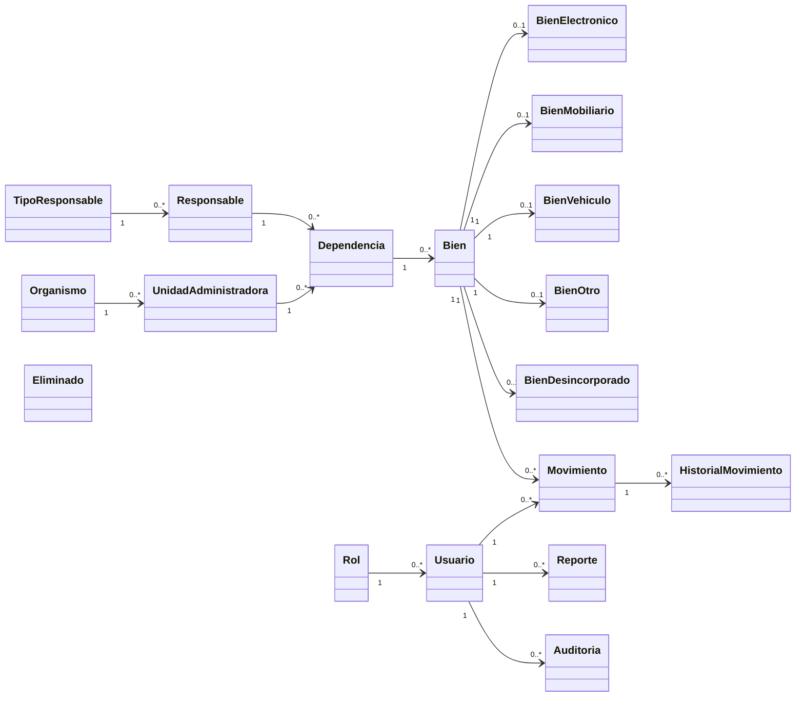
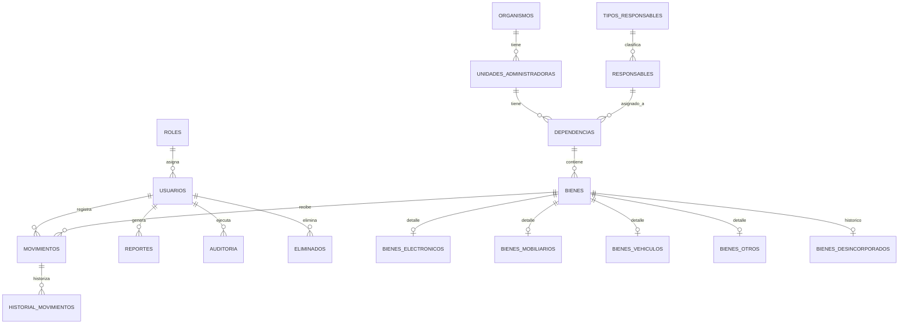

# Fase de Construcción
## Diseño arquitectónico
- Patrón MVC (Laravel).
- Capa de presentación con Blade/Tailwind.
- Capa de negocio en controladores y servicios.
- Capa de persistencia con Eloquent y migraciones.
## Servicios relevantes
- `CodigoJerarquicoService`
- `BienTypeService`
- `FpdfReportService`
- `ActaDesincorporacionService`
- `ActaTrasladoService`
- `ActaDonacionService`
- `EliminadosService`
- `MovimientoService`
## Diagrama de clases

## Diagrama entidad-relación

