# Diagrama Entidad-Relación del Sistema de Gestión de Bienes

## Sistema de Gestión de Inventario de Bienes - IUT

```mermaid
erDiagram
    %% ============================================
    %% ENTIDADES PRINCIPALES - JERARQUÍA ORGANIZACIONAL
    %% ============================================

    ORGANISMO {
        int id PK
        string codigo
        string nombre
        timestamp created_at
        timestamp updated_at
    }

    UNIDAD_ADMINISTRADORA {
        int id PK
        int organismo_id FK
        string codigo
        string nombre
        timestamp created_at
        timestamp updated_at
    }

    DEPENDENCIA {
        int id PK
        int unidad_administradora_id FK
        int responsable_id FK "nullable"
        string codigo
        string nombre
        timestamp created_at
        timestamp updated_at
    }

    %% ============================================
    %% RESPONSABLE Y TIPO DE RESPONSABLE
    %% ============================================

    TIPO_RESPONSABLE {
        int id PK
        string nombre
    }

    RESPONSABLE {
        int id PK
        int tipo_id FK
        string cedula
        string nombre
        string correo
        string telefono
    }

    %% ============================================
    %% BIENES - ENTIDAD CENTRAL
    %% ============================================

    BIEN {
        int id PK
        int dependencia_id FK "nullable"
        string codigo
        string descripcion
        decimal precio
        string fotografia
        string estado "enum: activo, desincorporado, etc."
        date fecha_registro
        string tipo_bien "enum: electronico, mobiliario, vehiculo, otro"
        json caracteristicas
        timestamp created_at
        timestamp updated_at
    }

    %% Sub-tipos de Bien (1:1 con BIEN)
    BIEN_ELECTRONICO {
        int id PK
        int bien_id FK
        string subtipo
        string procesador
        string memoria
        string almacenamiento
        string pantalla
        string serial
        date garantia
    }

    BIEN_MOBILIARIO {
        int id PK
        int bien_id FK
        string material
        string dimensiones
        string color
        string capacidad
        int cantidad_piezas
        string acabado
    }

    BIEN_VEHICULO {
        int id PK
        int bien_id FK
        string marca
        string modelo
        int anio
        string placa
        string motor
        string chasis
        string combustible
        int kilometraje
    }

    BIEN_OTRO {
        int id PK
        int bien_id FK
        string especificaciones
        int cantidad
        string presentacion
    }

    %% Bienes desincorporados (histórico)
    BIEN_DESINCORPORADO {
        int id PK
        int bien_id FK
        int dependencia_id FK "nullable"
        int responsable_id FK "nullable"
        string codigo
        string descripcion
        decimal precio
        string fotografia
        string estado
        date fecha_registro
        string tipo_bien
        json caracteristicas
        string motivo_desincorporacion
        string acta_desincorporacion
        datetime fecha_desincorporacion
        timestamp created_at
        timestamp updated_at
    }

    %% ============================================
    %% USUARIOS Y ROLES
    %% ============================================

    ROL {
        int id PK
        string nombre
        json permisos
    }

    USUARIO {
        int id PK
        int rol_id FK
        string cedula
        string nombre
        string apellido
        string foto_perfil
        string correo
        string hash_password
        boolean activo
        boolean is_admin
        string remember_token
        timestamp created_at
        timestamp updated_at
    }

    %% ============================================
    %% MOVIMIENTOS Y AUDITORÍA
    %% ============================================

    MOVIMIENTO {
        int id PK
        int bien_id FK
        int usuario_id FK
        string subject_type "polymorphic: Organismo, Unidad, Dependencia, Bien, Usuario"
        int subject_id
        string tipo "traslado, asignacion, desincorporacion, etc."
        datetime fecha
        string observaciones
        string descripcion
        string acta_path
        timestamp created_at
    }

    HISTORIAL_MOVIMIENTO {
        int id PK
        int movimiento_id FK
        string descripcion
        datetime fecha
    }

    AUDITORIA {
        int id PK
        int usuario_id FK
        string tabla
        int registro_id
        string operacion "create, update, delete"
        json valores_anteriores
        json valores_nuevos
        string descripcion
        string ip_address
        string user_agent
        timestamp created_at
    }

    %% ============================================
    %% REPORTES
    %% ============================================

    REPORTE {
        int id PK
        int usuario_id FK
        string tipo
        datetime fecha_generado
        string archivo_pdf_path
    }

    %% ============================================
    %% ELIMINADOS (SOFT DELETE)
    %% ============================================

    ELIMINADO {
        int id PK
        string tabla_origen
        int registro_id
        json datos
        string motivo
        int usuario_id FK
        datetime fecha_eliminacion
    }

    %% ============================================
    %% RELACIONES - JERARQUÍA ORGANIZACIONAL
    %% ============================================

    ORGANISMO ||--o{ UNIDAD_ADMINISTRADORA : "tiene"
    UNIDAD_ADMINISTRADORA ||--o{ DEPENDENCIA : "tiene"
    DEPENDENCIA ||--o{ BIEN : "contiene"

    %% ============================================
    %% RELACIONES - RESPONSABLE
    %% ============================================

    TIPO_RESPONSABLE ||--o{ RESPONSABLE : "clasifica"
    RESPONSABLE ||--o{ DEPENDENCIA : "gestiona"

    %% ============================================
    %% RELACIONES - BIENES Y SUB-TIPOS
    %% ============================================

    BIEN ||--o| BIEN_ELECTRONICO : "es_tipo"
    BIEN ||--o| BIEN_MOBILIARIO : "es_tipo"
    BIEN ||--o| BIEN_VEHICULO : "es_tipo"
    BIEN ||--o| BIEN_OTRO : "es_tipo"
    BIEN ||--o| BIEN_DESINCORPORADO : "desincorporado"

    %% ============================================
    %% RELACIONES - USUARIOS Y ROLES
    %% ============================================

    ROL ||--o{ USUARIO : "asigna"

    %% ============================================
    %% RELACIONES - MOVIMIENTOS
    %% ============================================

    BIEN ||--o{ MOVIMIENTO : "genera"
    USUARIO ||--o{ MOVIMIENTO : "ejecuta"
    MOVIMIENTO ||--o{ HISTORIAL_MOVIMIENTO : "tiene"

    %% ============================================
    %% RELACIONES - AUDITORÍA
    %% ============================================

    USUARIO ||--o{ AUDITORIA : "realiza"
    USUARIO ||--o{ REPORTE : "genera"

    %% ============================================
    %% RELACIONES - ELIMINADOS
    %% ============================================

    USUARIO ||--o{ ELIMINADO : "elimina"
```

## Descripción de Entidades

### Entidades Principales

| Entidad | Descripción | Tabla |
|---------|-------------|-------|
| **Organismo** | Entidad de nivel superior (ej: MPP Educación) | organismos |
| **UnidadAdministradora** | Unidad dentro del organismo | unidades_administradoras |
| **Dependencia** | Departamento/Unidad dentro de la unidad administrativa | dependencias |
| **Bien** | Activo/Bien institucional | bienes |

### Entidades de Gestión de Bienes

| Entidad | Descripción | Tabla |
|---------|-------------|-------|
| **Responsable** | Persona responsable de bienes | responsables |
| **TipoResponsable** | Tipo de responsable (docente, administrativo, etc.) | tipos_responsables |
| **BienElectronico** | Detalles de bienes electrónicos | bienes_electronicos |
| **BienMobiliario** | Detalles de bienes mobiliarios | bienes_mobiliarios |
| **BienVehiculo** | Detalles de vehículos | bienes_vehiculos |
| **BienOtro** | Otros tipos de bienes | bienes_otros |
| **BienDesincorporado** | Bienes dados de baja | bienes_desincorporados |

### Entidades de Seguridad y Auditoría

| Entidad | Descripción | Tabla |
|---------|-------------|-------|
| **Usuario** | Usuarios del sistema | usuarios |
| **Rol** | Roles de usuario | roles |
| **Auditoria** | Registro de cambios en el sistema | auditoria |
| **Movimiento** | Historial de movimientos de bienes | movimientos |
| **HistorialMovimiento** | Detalles del historial | historial_movimientos |
| **Reporte** | Reportes generados | reportes |
| **Eliminado** | Bienes eliminados (soft delete) | eliminados |

## Tipos de Relaciones

1. **1:N (Uno a Muchos)**: Organismo → Unidad → Dependencia → Bien
2. **1:1 (Uno a Uno)**: Bien → Subtipos (Electronico, Mobiliario, Vehiculo, Otro)
3. **Polimórfica**: Movimiento puede referirse a cualquier entidad
4. **Soft Delete**: Eliminado guarda copia de registros borrados
