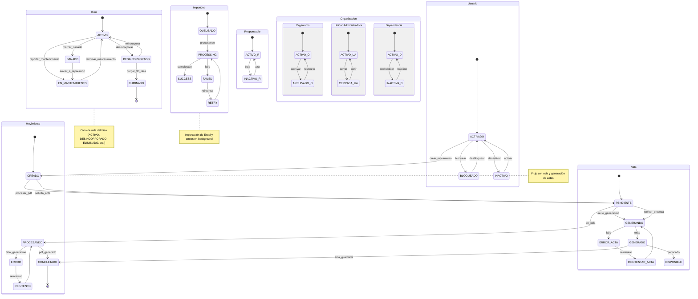

# Diagrama de Estado — Máquinas de estado del sistema (completo)

Este diagrama ahora incluye las máquinas de estado para las entidades principales del sistema:
- `Bien`, `Movimiento`, `Usuario`, `Responsable`, `Organismo`, `UnidadAdministradora`, `Dependencia`, `ImportJob` (importación de Excel) y `Acta` (estado de generación de PDF).

