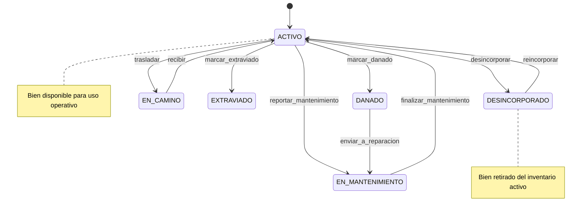

# Diagrama de Estado del Sistema — RUP

## Alcance

Este diagrama describe el ciclo de vida principal del `Bien` en el sistema de inventario, incluyendo las transiciones implementadas en el código fuente.

Se basa en:
- `app/Enums/EstadoBien.php`
- Acciones de `app/Http/Controllers/BienController.php`

## Diagrama de estados

## Notas

- El estado `DESINCORPORADO` representa la baja administrativa registrada en la aplicación.
- El flujo actual del sistema no implementa eliminación física automática de bienes desincorporados.
- Las transiciones `trasladar` y `reincorporar` reflejan los procesos de movimiento entre dependencias y restauración del bien al inventario activo.
