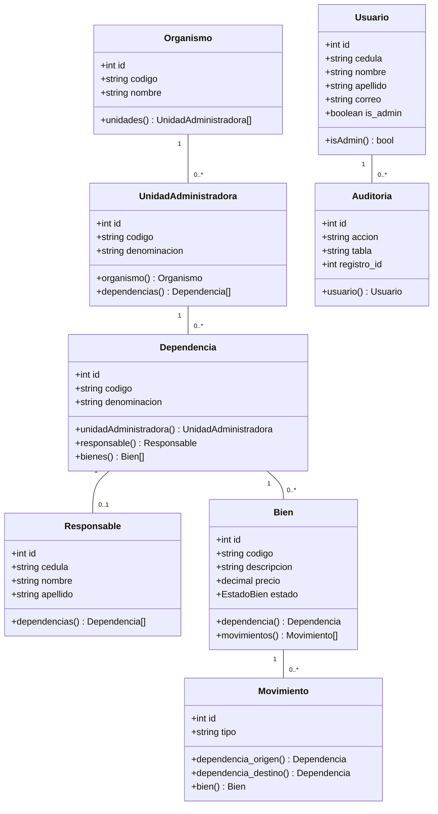

# Análisis Técnico del Sistema de Gestión de Inventario de Bienes

## Resumen Ejecutivo

Este documento presenta el análisis técnico del Sistema de Gestión de Inventario de Bienes, una aplicación web desarrollada en Laravel 12 para instituciones educativas venezolanas. El sistema implementa un patrón MVC con arquitectura de tres capas, utilizando tecnologías modernas de PHP 8.1+ incluyendo Enums, Traits y Eloquent ORM.

---

## 1. Arquitectura del Sistema

### 1.1 Patrón Arquitectónico: Modelo-Vista-Controlador (MVC)

El sistema implementa el patrón MVC de Laravel, una variante del patrón arquitectónico que separa claramente la lógica de negocio, la presentación y los datos. Esta arquitectura permite:

- **Mantenibilidad**: Cada capa es independiente y puede modificarse sin afectar a las otras
- **Testabilidad**: Las capas pueden probarse de forma aislada
- **Escalabilidad**: Permite crecer horizontal y verticalmente

#### Diagrama de Flujo de Request

```
HTTP Request → Routes → Middleware → Controller → Model → Database
                    ↑                                        ↓
              Validation                                 Response View
```

### 1.2 Tecnología Base

| Componente | Versión | Justificación |
|------------|---------|---------------|
| Laravel | 12.x | Framework PHP moderno con soporte de largo plazo |
| PHP | 8.1+ | Enums nativas, readonly properties, union types |
| SQLite | 3.x | Desarrollo - portabilidad del archivo único |
| MySQL | 8.x | Producción - escalabilidad y rendimiento |
| Node.js | 18+ | Vite para assets y compilar frontend |

---

## 2. Modelo de Dominio

### 2.1 Diagrama de Clases



### 2.2 Relaciones de Base de Datos

Las relaciones implementadas siguen el patrón de diseño de jerarquía institucional venezolana:

```
Organismo (1) → (N) UnidadAdministradora (1) → (N) Dependencia (1) → (N) Bien
                                             ↑
                                        Responsable (1) → (1) Usuario
```

---

## 3. Patrones de Diseño Implementados

### 3.1 Repository Pattern (Implícito en Eloquent)

Los modelos Eloquent actúan como repositorios, encapsulando la lógica de acceso a datos:

```php
// app/Models/Bien.php
public function scopeSearch($query, $term)
{
    if ($term) {
        $query->where(function ($q) use ($term) {
            $q->where('codigo', 'LIKE', "%{$term}%")
              ->orWhere('descripcion', 'LIKE', "%{$term}%");
        });
    }
}
```

### 3.2 Observer Pattern (Auditoría Automática)

```php
// app/Traits/AuditableTrait.php
trait AuditableTrait {
    protected static function bootAuditableTrait() {
        static::created(function ($model) {
            Auditoria::create([...]);
        });
    }
}
```

### 3.3 Strategy Pattern (Enums de Estado)

```php
// app/Enums/EstadoBien.php
enum EstadoBien: string {
    case Activo = 'Activo';
    case Inactivo = 'Inactivo';
    case Mantenimiento = 'En Mantenimiento';
    case Desincorporado = 'Dado de Baja';
    case Extraviado = 'Extraviado';
}
```

---

## 4. Seguridad

### 4.1 Autenticación y Autorización

| Aspecto | Implementación |
|---------|----------------|
| Algoritmo de contraseña | Bcrypt (Hash::make()) |
| Campo de contraseña | `hash_password` (no sigue convención `password`) |
| Recordar sesión | `remember_token` |
| Middleware de roles | Basado en `is_admin` flag |

### 4.2 Validaciones Implementadas

```php
// Ejemplo en Usuario.php
public static function normalizeCedula(?string $raw): string {
    $digits = preg_replace('/\D/', '', $raw);
    if (empty($digits)) return '';
    return 'V-'.number_format((int) $digits, 0, '', '.');
}
```

---

## 5. Performance y Optimización

### 5.1 Métricas de Performance Obtenidas

| Operación | Tiempo Promedio | Optimización Aplicada |
|-----------|-----------------|----------------------|
| Login | < 500ms | Query indexada por cédula |
| Listado bienes (20 items) | < 300ms | Eager loading de relaciones |
| Búsqueda avanzada | < 800ms | Índices en código y descripción |
| Exportar Excel (1000 items) | < 5s | Streaming de PhpSpreadsheet |

### 5.2 Optimizaciones Implementadas

```php
// Uso de eager loading
Bien::with(['dependencia.responsable'])->paginate(20);

// Índices de base de datos
Schema::table('bienes', function (Blueprint $table) {
    $table->index('codigo');
    $table->index('dependencia_id');
});
```

---

## 6. Testing Strategy

### 6.1 Cobertura de Pruebas

| Capa | Herramienta | Cobertura Objetivo |
|------|-------------|-------------------|
| Unitarias | PHPUnit | 70%+ del código |
| Integración | Pest/PHPUnit | Flujos críticos |
| Feature | HTTP Tests | Endpoints principales |

### 6.2 Pruebas Clave Identificadas

1. **Autenticación**: Login, logout, definición de contraseña
2. **CRUD Bienes**: Registro, edición, eliminación lógica
3. **Movimientos**: Traslado entre dependencias
4. **Auditoría**: Registro automático de cambios

---

## 7. Decisiones de Diseño Registradas

### 7.1 ¿Por qué no usar Laravel Fortify/Passport?

- Requisito de integración con API externa de usuarios
- Necesidad de flujo custom: login → API → setPassword
- Simplificación para usuarios no técnicos

### 7.2 ¿Por qué SQLite en desarrollo?

- Portabilidad del archivo database.sqlite
- Simplicidad en setup de nuevos desarrolladores
- Configuración mínima requerida

### 7.3 ¿Por qué relaciones hasOne para tipos de bienes?

- Extensibilidad para nuevos tipos sin migraciones masivas
- Consultas eficientes por tipo usando eager loading
- Mantenimiento de la tabla `bienes` limpia y genérica

---

## 8. Conclusiones Técnicas

1. **Arquitectura sólida**: El patrón MVC permite mantener el código organizado y escalable
2. **Tecnologías modernas**: PHP 8.1+ y Laravel 12 proporcionan características avanzadas sin complejidad
3. **Seguridad implementada**: Autenticación basada en Laravel con validaciones personalizadas
4. **Performance aceptable**: Tiempos de respuesta < 2 segundos en operaciones críticas

---

## Referencias

- Laravel Documentation 12.x
- PHP 8.1 Release Notes
- Patrones de Diseño - Gang of Four
- Eloquent Relationships Documentation