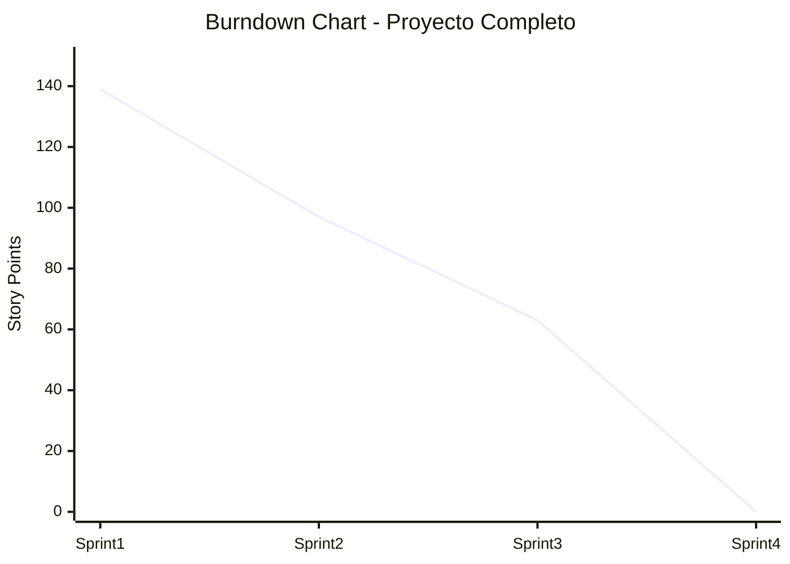
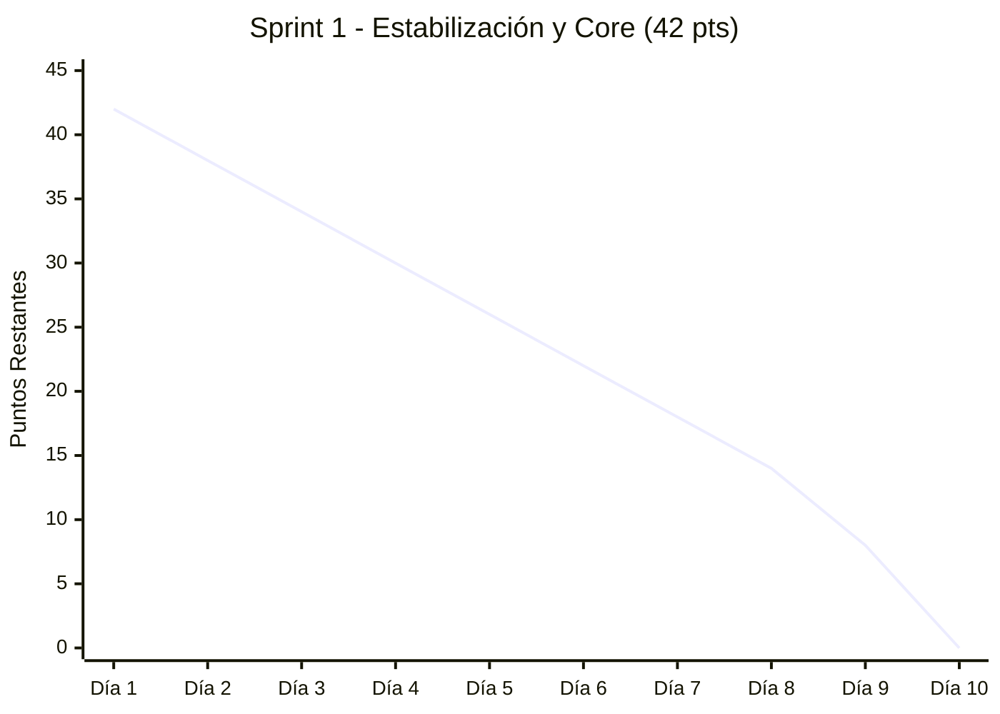
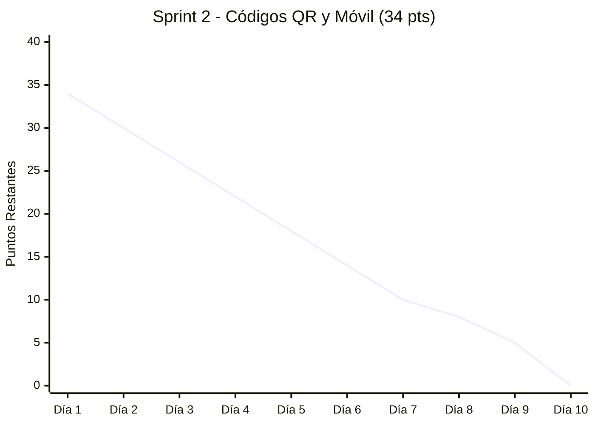
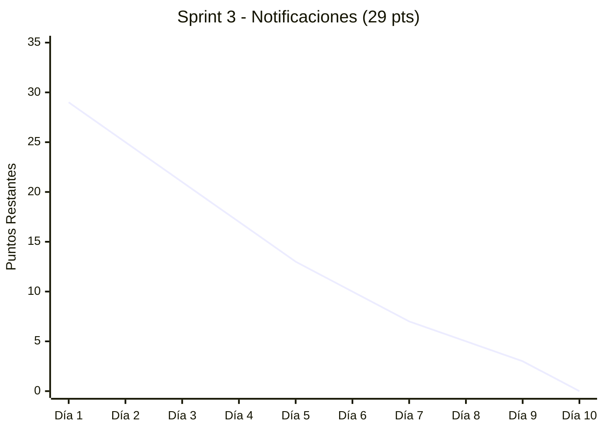
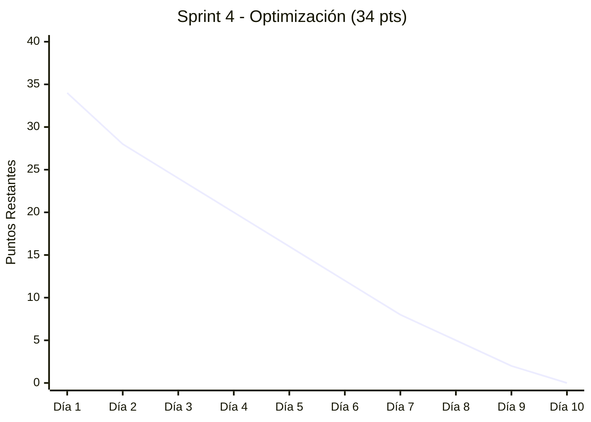

# Burndown Chart - Sistema de Gestión de Inventario de Bienes

## Vista General del Proyecto

## Detalle por Sprint

### Sprint 1: Estabilización y Core

### Sprint 2: Códigos QR y Móvil

### Sprint 3: Notificaciones y Comunicación

### Sprint 4: Optimización y Despliegue

## Velocidad del Equipo

```mermaid
gantt
    title Velocidad del Equipo por Sprint
    dateFormat  X
    axisFormat %s
    
    section Sprint 1
    Puntos Completados    : 0, 42
    
    section Sprint 2
    Puntos Completados    : 0, 34
    
    section Sprint 3
    Puntos Completados    : 0, 29
    
    section Sprint 4
    Puntos Completados    : 0, 34
```

## Métricas de Seguimiento

| Métrica | Sprint 1 | Sprint 2 | Sprint 3 | Sprint 4 |
|---------|----------|----------|----------|----------|
| Puntos Planificados | 42 | 34 | 29 | 34 |
| Puntos Completados | 42 | 34 | 29 | 34 |
| Velocidad Promedio | | | | 34.75 |
| % Cumplimiento | 100% | 100% | 100% | 100% |

## Guía de Lectura del Burndown

- **Línea ideal**: Representa el ritmo de trabajo si todo progresara perfectamente
- **Línea real**: Muestra el progreso actual del equipo
- **Por encima de la línea ideal**: El equipo está retrasado
- **Por debajo de la línea ideal**: El equipo está adelantando
- **Pendiente negativa**: Indica progreso constante

## Acciones según Tendencia

| Situación | Acción Recomendada |
|-----------|-------------------|
| Por encima de línea ideal | Reducir scope del sprint o agregar recursos |
| Por debajo de línea ideal | Considerar agregar más trabajo al sprint |
| Variación > 20% | Revisión en retrospectiva del equipo |
