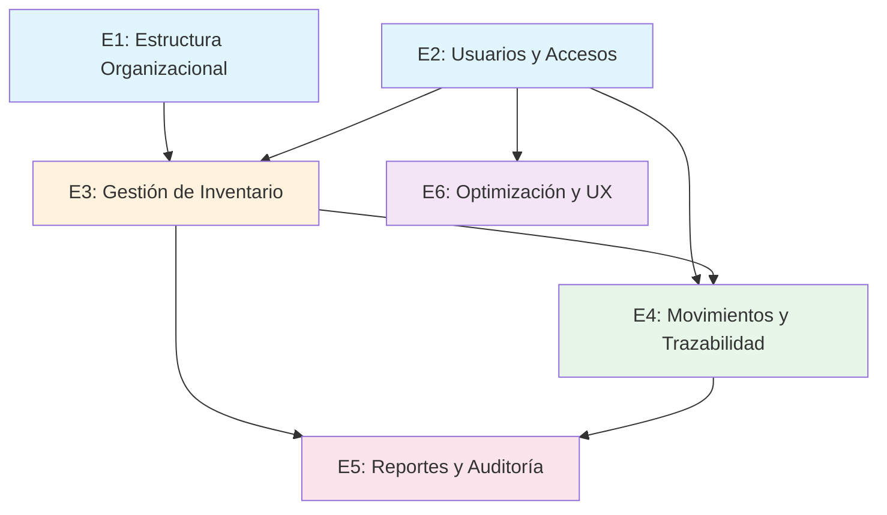

# Épicas y Dependencias - Sistema de Gestión de Inventario de Bienes

## Resumen de Épicas

---

## Catálogo de Épicas

### E1: Gestión de Estructura Organizacional

**Descripción:** Gestión jerárquica de organismos, unidades administrativas y dependencias.

**Usuario Objetivo:** Administrador del sistema

**Alcance:**
- CRUD de Organismos
- CRUD de Unidades Administradoras
- CRUD de Dependencias
- Visualización de jerarquía completa

**Estado:** ✅ Implementado

**Historias Asociadas:**
| ID | Historia | Puntos | Sprint |
|----|----------|--------|--------|
| HU-004 | Crear Organismo | 5 | Sprint 1 (Original) |
| HU-005 | Crear Unidad Administradora | 5 | Sprint 1 (Original) |
| HU-006 | Crear Dependencia | 5 | Sprint 1 (Original) |
| HU-018 | Registrar Responsable | 5 | Sprint 3 |

---

### E2: Gestión de Usuarios y Accesos

**Descripción:** Sistema de autenticación, roles y permisos de usuarios.

**Usuario Objetivo:** Administrador, Gerente de Bienes, Usuario Responsable

**Alcance:**
- Registro de usuarios
- Autenticación y autorización
- Roles: Administrador, Gerente, Responsable
- Gestión de perfiles
- Recuperación de contraseña

**Estado:** ⚠️ Parcialmente implementado
- ✅ Login/Logout
- ✅ Gestión de usuarios
- ✅ Perfil de usuario
- ❌ Recuperación de contraseña

**Historias Asociadas:**
| ID | Historia | Puntos | Sprint |
|----|----------|--------|--------|
| HU-001 | Registro de Usuarios Administradores | 5 | Sprint 1 (Original) |
| HU-002 | Iniciar Sesión en el Sistema | 5 | Sprint 1 (Original) |
| HU-003 | Cerrar Sesión | 3 | Sprint 1 (Original) |
| HU-017 | Gestionar Tipos de Responsables | 5 | Sprint 3 |
| HU-026 | Perfil de Usuario | 5 | Sprint 2 |
| HU-027 | Recuperar Contraseña | 8 | Sprint 1 |
| HU-029 | Dashboard de Responsable | 8 | Sprint 2 |

---

### E3: Gestión de Inventario de Bienes

**Descripción:** Registro, actualización, búsqueda y seguimiento de bienes patrimoniales.

**Usuario Objetivo:** Gerente de Bienes

**Alcance:**
- Registro de bienes con fotos (hasta 5)
- Edición de información
- Búsqueda avanzada
- Listados con filtros
- Estados de bienes

**Estado:** ⚠️ Parcialmente implementado
- ✅ CRUD completo de bienes
- ✅ Fotos y galería
- ✅ Búsqueda y filtros
- ❌ Importación desde Excel

**Historias Asociadas:**
| ID | Historia | Puntos | Sprint |
|----|----------|--------|--------|
| HU-007 | Registrar Bien en Inventario | 8 | Sprint 2 (Original) |
| HU-008 | Listar Bienes por Dependencia | 5 | Sprint 2 (Original) |
| HU-009 | Ver Detalle de un Bien | 5 | Sprint 2 (Original) |
| HU-010 | Editar Información de un Bien | 5 | Sprint 2 (Original) |
| HU-020 | Marcar Bien como Inactivo/Dado de Baja | 5 | Sprint 4 (Original) |
| HU-022 | Importar Bienes desde Excel | 13 | Sprint 1 |

---

### E4: Gestión de Movimientos y Trazabilidad

**Descripción:** Control de traslados, asignaciones y cambios de responsabilidad de bienes.

**Usuario Objetivo:** Gerente de Bienes

**Alcance:**
- Registro de traslados
- Cambios de responsabilidad
- Historial completo
- Documentos de autorización

**Estado:** ✅ Implementado

**Historias Asociadas:**
| ID | Historia | Puntos | Sprint |
|----|----------|--------|--------|
| HU-011 | Registrar Movimiento de Bien | 8 | Sprint 3 (Original) |
| HU-012 | Cambiar Responsable de un Bien | 5 | Sprint 3 (Original) |
| HU-013 | Ver Historial de Movimientos | 5 | Sprint 3 (Original) |

---

### E5: Reportes y Auditoría

**Descripción:** Generación de reportes, consultas y auditoría del sistema.

**Usuario Objetivo:** Administrador, Gerente de Bienes, Auditores

**Alcance:**
- Reporte de inventario por dependencia
- Reporte por responsable
- Exportación a Excel
- Auditoría automática

**Estado:** ⚠️ Parcialmente implementado
- ✅ Reportes PDF
- ❌ Exportación a Excel
- ✅ Sistema de auditoría

**Historias Asociadas:**
| ID | Historia | Puntos | Sprint |
|----|----------|--------|--------|
| HU-014 | Generar Reporte de Inventario por Dependencia | 8 | Sprint 3 (Original) |
| HU-016 | Dashboard de Administrador | 8 | Sprint 4 (Original) |
| HU-019 | Registro de Auditoría del Sistema | 8 | Sprint 4 (Original) |
| HU-023 | Exportar Inventario a Excel | 5 | Sprint 1 |
| HU-028 | Reporte de Bienes por Responsable | 5 | Sprint 2 |

---

### E6: Optimización y Experiencia de Usuario

**Descripción:** Mejoras de rendimiento, usabilidad y funcionalidades avanzadas.

**Usuario Objetivo:** Todos los usuarios

**Alcance:**
- Códigos QR
- Escaneo desde móvil
- Notificaciones por correo
- Filtros avanzados
- Mejoras de UX

**Estado:** ❌ Mayormente pendiente

**Historias Asociadas:**
| ID | Historia | Puntos | Sprint |
|----|----------|--------|--------|
| HU-015 | Buscar Bienes Globalmente | 8 | Sprint 3 (Original) |
| HU-021 | Notificaciones por Correo | 8 | Sprint 3 |
| HU-024 | Generar Código QR para Bienes | 8 | Sprint 2 |
| HU-025 | Escanear Código QR desde Móvil | 8 | Sprint 2 |
| HU-030 | Filtros Avanzados en Listados | 8 | Sprint 1 |

---

## Matriz de Dependencias

| Historia | Depende de | Tipo |
|----------|------------|------|
| HU-022 Import Excel | HU-007 (Registrar Bien) | Requisito |
| HU-023 Export Excel | HU-008 (Listar Bienes) | Requisito |
| HU-024 Generar QR | HU-009 (Ver Detalle) | Requisito |
| HU-025 Escanear QR | HU-024 (Generar QR) | Secuencial |
| HU-027 Recuperar Pass | HU-002 (Login) | Requisito |
| HU-028 Reporte Responsable | HU-012 (Cambiar Responsable) | Requisito |
| HU-029 Dashboard Responsable | HU-018 (Registrar Responsable) | Requisito |
| HU-030 Filtros Avanzados | HU-008 (Listar Bienes) | Mejora |

---

## Priorización de Épicas

| Épica | Prioridad | Estado | Puntos Pendientes |
|-------|----------|--------|-------------------|
| E3 Gestión de Inventario | Crítica | ⚠️ Parcial | 13 |
| E2 Usuarios y Accesos | Crítica | ⚠️ Parcial | 21 |
| E5 Reportes y Auditoría | Alta | ⚠️ Parcial | 13 |
| E6 Optimización y UX | Media | ❌ Pendiente | 40 |
| E1 Estructura Organizacional | Crítica | ✅ Completado | 0 |
| E4 Movimientos | Alta | ✅ Completado | 0 |

---

## Recomendaciones de Ejecución

1. **Sprint 1** debe enfocarse en E3 y E2 (funcionalidades críticas pendientes)
2. **Sprint 2** puede ejecutarse en paralelo E6 (QR) y E5 (reportes)
3. **Sprint 3** completar E6 (notificaciones) y E2
4. **Sprint 4** optimización general y despliegue
