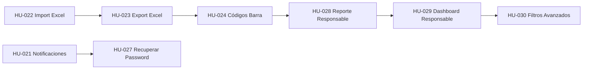

# Plan de Acción para Implementación

## Sistema de Gestión de Inventario de Bienes

---

## Resumen de Funcionalidades Pendientes

| ID | Historia de Usuario | Puntos | Prioridad |
|----|---------------------|--------|-----------|
| HU-024 | Generar Código de Barra | 8 | Alta |
| HU-022 | Importar Bienes desde Excel | 13 | Alta |
| HU-023 | Exportar Inventario a Excel | 5 | Alta |
| HU-021 | Notificaciones por Correo | 8 | Media |
| HU-027 | Recuperar Contraseña | 8 | Media |
| HU-028 | Reporte de Bienes por Responsable | 5 | Media |
| HU-029 | Dashboard de Responsable | 8 | Media |
| HU-030 | Filtros Avanzados en Listados | 8 | Baja |
| HU-026 | Perfil de Usuario (mejoras) | 3 | Baja |

**Total: 66 puntos de historia**

---

## Plan de Implementación por Fase

### FASE 1: Funcionalidades Core de Import/Export (2 semanas)

**Objetivo:** Permitir importación y exportación masiva de datos

#### Semana 1: Importación de Bienes desde Excel

| Día | Tarea | Responsable |
|-----|-------|-------------|
| 1 | Instalar librería Maatwebsite/Excel | Backend |
| 2 | Crear modelo y migración para templates de importación | Backend |
| 3 | Diseñar template Excel descargable | Frontend |
| 4 | Crear formulario de carga de archivo | Frontend |
| 5 | Implementar validación de formato | Backend |

| Día | Tarea | Responsable |
|-----|-------|-------------|
| 6-7 | Implementar validación fila por fila | Backend |
| 8 | Crear reporte de errores detallado | Backend |
| 9 | Implementar importación en lote (cola) | Backend |
| 10 | Crear barra de progreso AJAX | Frontend |

**Entregable:** HU-022 completa (13 pts)

#### Semana 2: Exportación a Excel

| Día | Tarea | Responsable |
|-----|-------|-------------|
| 1-2 | Implementar exportación de bienes | Backend |
| 3 | Agregar filtros a la exportación | Backend |
| 4 | Crear hoja resumen con totales | Backend |
| 5 | Testing y corrección de errores | QA |

**Entregable:** HU-023 completa (5 pts)

---

### FASE 2: Códigos de Barra (1 semana)

**Objetivo:** Implementar generación de códigos de barra para bienes

#### Semana 3: Generación de Códigos de Barra

| Día | Tarea | Responsable |
|-----|-------|-------------|
| 1 | Instalar librería de códigos de barra (Picqer/xero-identifier-barcodes) | Backend |
| 2 | Crear método en modelo Bien para generar código | Backend |
| 3 | Crear endpoint de descarga individual | Backend |
| 4 | Implementar generación masiva | Backend |
| 5 | Diseñar template de etiquetas para imprimir | Frontend |

**Entregable:** HU-024 completa (8 pts)

---

### FASE 3: Notificaciones y Seguridad (2 semanas)

**Objetivo:** Implementar sistema de notificaciones y recuperación de contraseñas

#### Semana 4: Notificaciones por Correo

| Día | Tarea | Responsable |
|-----|-------|-------------|
| 1 | Configurar SMTP en .env | Backend |
| 2 | Crear templates de email con Blade | Backend |
| 3 | Implementar listener para eventos de bienes | Backend |
| 4 | Agregar opción de preferencias en perfil | Frontend |
| 5 | Testing de envío de correos | QA |

**Entregable:** HU-021 completa (8 pts)

#### Semana 5: Recuperación de Contraseña

| Día | Tarea | Responsable |
|-----|-------|-------------|
| 1-2 | Crear tabla de tokens de recuperación | Backend |
| 3 | Implementar formulario de solicitud | Frontend |
| 4 | Implementar envío de email con token | Backend |
| 5 | Crear formulario de reset | Frontend |

**Entregable:** HU-027 completa (8 pts)

---

### FASE 4: Reportes y Dashboards (2 semanas)

**Objetivo:** Completar reportes y dashboards pendientes

#### Semana 6: Reporte por Responsable

| Día | Tarea | Responsable |
|-----|-------|-------------|
| 1-2 | Crear endpoint de reporte por responsable | Backend |
| 3 | Diseñar template PDF | Backend |
| 4 | Agregar cálculo de valor total | Backend |
| 5 | Testing | QA |

**Entregable:** HU-028 completa (5 pts)

#### Semana 7: Dashboard de Responsable

| Día | Tarea | Responsable |
|-----|-------|-------------|
| 1-2 | Diseñar dashboard de responsable | Frontend |
| 3 | Implementar métricas de bienes asignados | Backend |
| 4 | Agregar alertas de mantenimiento | Backend |
| 5 | Implementar impresión de constancia | Backend |

**Entregable:** HU-029 completa (8 pts)

---

### FASE 5: Mejoras Finales (1 semana)

**Objetivo:** Completar funcionalidades menores y optimizar

| Día | Tarea | Responsable |
|-----|-------|-------------|
| 1-2 | Filtros avanzados en listados | Frontend/Backend |
| 3-4 | Mejoras en perfil de usuario | Frontend |
| 5 | Testing de regresión | QA |

**Entregable:** HU-030 y HU-026 completas (11 pts)

---

## Dependencias Técnicas

## Paquetes Requeridos

| Paquete | Uso | Instalación |
|---------|-----|-------------|
| maatwebsite/excel | Import/Export Excel | `composer require maatwebsite/excel` |
| picqer/php-barcode-generator | Generación códigos de barra | `composer require picqer/php-barcode-generator` |
| laravel/socialite | Autenticación social (opcional) | `composer require laravel/socialite` |

## Checklist de Pruebas

- [ ] Pruebas unitarias para cada modelo modificado
- [ ] Pruebas de integración para importación
- [ ] Pruebas de aceptación para flujos de usuario
- [ ] Pruebas de rendimiento para exportaciones grandes
- [ ] Pruebas en dispositivos móviles para escaneo
- [ ] Pruebas de correo en ambiente de staging

## Asignación de Recursos

| Recurso | Asignación |
|---------|------------|
| Desarrollador Backend Senior | Import/Export, Códigos de Barra, Notificaciones |
| Desarrollador Frontend | UI/UX, Dashboard, Filtros |
| QA Engineer | Testing, Validación |
| Product Owner | Revisión, Priorización |

---

## Cronograma Resumido

| Semana | Funcionalidad | Puntos Acumulados |
|--------|---------------|-------------------|
| 1-2 | Import/Export Excel | 18 |
| 3 | Códigos de Barra | 8 |
| 4 | Notificaciones | 8 |
| 5 | Recuperar Contraseña | 8 |
| 6 | Reporte Responsable | 5 |
| 7 | Dashboard Responsable | 8 |
| 8 | Filtros y Mejoras | 11 |
| **TOTAL** | | **66 puntos** |

---

## Recomendaciones

1. **Priorizar Import/Export Excel** - Tiene alto impacto y facilita la carga inicial de datos
2. **Implementar códigos de barra** - Ya tiene el escaneo móvil completado
3. **Notificaciones por correo** - Requiere configuración SMTP previa
4. **Seguir orden de dependencias** - No comenzar una fase sin completar la anterior
