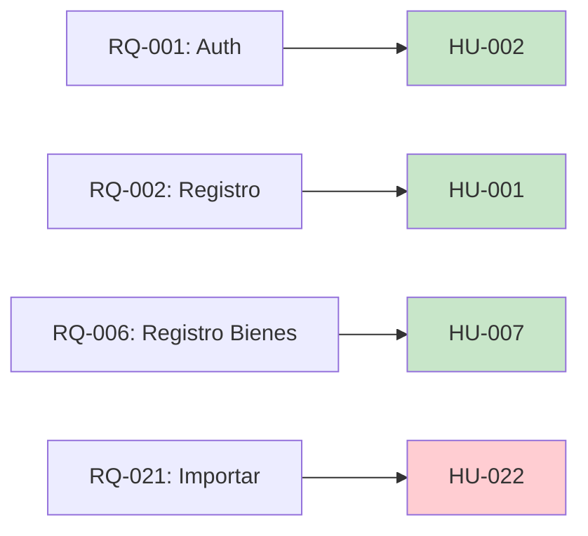

# MATRIZ DE REQUISITOS
## Sistema de Gestión de Inventario de Bienes

| ID | Requisito | Descripción | Prioridad | Estado | Fuente |
|----|-----------|-------------|-----------|--------|--------|
| RQ-001 | Autenticación de usuarios | El sistema debe permitir el inicio de sesión con correo y contraseña | Alta | ✅ Completado | HU-002 |
| RQ-002 | Registro de usuarios | El sistema debe permitir crear usuarios con diferentes roles | Alta | ✅ Completado | HU-001 |
| RQ-003 | Gestión de organismos | CRUD de organismos con información básica | Alta | ✅ Completado | HU-004 |
| RQ-004 | Gestión de unidades administradoras | CRUD de unidades vinculadas a organismos | Alta | ✅ Completado | HU-005 |
| RQ-005 | Gestión de dependencias | CRUD de dependencias vinculadas a unidades | Alta | ✅ Completado | HU-006 |
| RQ-006 | Registro de bienes | Crear bienes con información completa y fotos | Alta | ✅ Completado | HU-007 |
| RQ-007 | Listado de bienes | Visualizar bienes por dependencia con filtros | Alta | ✅ Completado | HU-008 |
| RQ-008 | Detalle de bien | Ver información completa de un bien específico | Media | ✅ Completado | HU-009 |
| RQ-009 | Edición de bienes | Actualizar información de bienes registrados | Alta | ✅ Completado | HU-010 |
| RQ-010 | Registro de movimientos | Registrar traslado de bienes entre dependencias | Alta | ✅ Completado | HU-011 |
| RQ-011 | Cambio de responsable | Asignar nuevo responsable a un bien | Alta | ✅ Completado | HU-012 |
| RQ-012 | Historial de movimientos | Ver historial completo de movimientos de un bien | Alta | ✅ Completado | HU-013 |
| RQ-013 | Reporte de inventario | Generar reporte PDF por dependencia | Alta | ✅ Completado | HU-014 |
| RQ-014 | Búsqueda global | Buscar bienes por múltiples criterios | Alta | ✅ Completado | HU-015 |
| RQ-015 | Dashboard de administrador | Panel con métricas y estadísticas del sistema | Alta | ✅ Completado | HU-016 |
| RQ-016 | Tipos de responsables | Gestionar tipos de cargos de responsables | Media | ✅ Completado | HU-017 |
| RQ-017 | Registro de responsables | Crear responsables vinculados a dependencias | Alta | ✅ Completado | HU-018 |
| RQ-018 | Auditoría del sistema | Registro automático de acciones del usuario | Alta | ✅ Completado | HU-019 |
| RQ-019 | Estado inactivo/baja | Marcar bienes como dados de baja | Media | ✅ Completado | HU-020 |
| RQ-020 | Notificaciones por correo | Enviar notificaciones de cambios de bienes | Media | ⏳ Pendiente | HU-021 |
| RQ-021 | Importar desde Excel | Carga masiva de bienes desde archivo Excel | Alta | ⏳ Pendiente | HU-022 |
| RQ-022 | Exportar a Excel | Descargar inventario en formato Excel | Alta | ⏳ Pendiente | HU-023 |
| RQ-023 | Generar código QR | Crear código QR para cada bien | Media | ⏳ Pendiente | HU-024 |
| RQ-024 | Escanear código QR | Leer código QR desde dispositivo móvil | Media | ⚠️ Parcial | HU-025 |
| RQ-025 | Perfil de usuario | Ver y editar información personal | Media | ⚠️ Parcial | HU-026 |
| RQ-026 | Recuperar contraseña | Recuperar acceso vía correo electrónico | Media | ⏳ Pendiente | HU-027 |
| RQ-027 | Reporte por responsable | Generar reporte de bienes por responsable | Media | ⏳ Pendiente | HU-028 |
| RQ-028 | Dashboard responsable | Panel de control para usuarios responsables | Media | ⏳ Pendiente | HU-029 |
| RQ-029 | Filtros avanzados | Filtrado avanzado en listados de bienes | Baja | ⏳ Pendiente | HU-030 |

---

## Trazabilidad de Requisitos

---

## Requisitos No Funcionales

| ID | Requisito | Descripción | Prioridad | Estado |
|----|-----------|-------------|-----------|--------|
| RNF-001 | Seguridad | Autenticación y autorización robusta | Crítica | ✅ |
| RNF-002 | Disponibilidad | 99.5% uptime | Alta | ✅ |
| RNF-003 | Rendimiento | Tiempo respuesta < 2 segundos | Alta | ✅ |
| RNF-004 | Usabilidad | Interfaz intuitiva y responsive | Alta | ✅ |
| RNF-005 | Escalabilidad | Soportar 50,000 bienes | Alta | ✅ |
| RNF-006 | Auditoría | Registro de todas las acciones | Alta | ✅ |