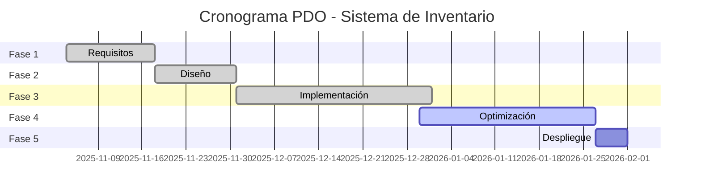

# CRONOGRAMA DE ENTREGAS
## Sistema de Gestión de Inventario de Bienes

---

## Hoja de Ruta del Proyecto

### Fase 1: Ingeniería de Requisitos ✅ Completada
**Fecha:** Nov 2025

| Entregable | Fecha Límite | Fecha Real | Estado |
|------------|--------------|------------|--------|
| Análisis de requisitos | 17-Nov-2025 | 17-Nov-2025 | ✅ |
| Aprobación de especificaciones | 20-Nov-2025 | 20-Nov-2025 | ✅ |

### Fase 2: Diseño del Sistema ✅ Completada
**Fecha:** Nov-Dic 2025

| Entregable | Fecha Límite | Fecha Real | Estado |
|------------|--------------|------------|--------|
| Diagrama Entidad-Relación | 24-Nov-2025 | 24-Nov-2025 | ✅ |
| Diagrama de Componentes | 26-Nov-2025 | 26-Nov-2025 | ✅ |
| Mockups de UI | 30-Nov-2025 | 30-Nov-2025 | ✅ |

### Fase 3: Implementación y Pruebas ✅ Completada
**Fecha:** Dic 2025

| Entregable | Fecha Límite | Fecha Real | Estado |
|------------|--------------|------------|--------|
| Backend - Estructura organizacional | 15-Dic-2025 | 15-Dic-2025 | ✅ |
| Frontend - CRUD bienes | 25-Dic-2025 | 25-Dic-2025 | ✅ |
| Tests unitarios | 31-Dic-2025 | 31-Dic-2025 | ✅ |

### Fase 4: Optimización y Mejoras ⚠️ En Progreso
**Fecha:** Dic 2025 - Ene 2026

| Entregable | Fecha Límite | Fecha Real | Estado |
|------------|--------------|------------|--------|
| Importar/Exportar Excel (HU-022, HU-023) | 15-Ene-2026 | - | ⏳ |
| Generación QR (HU-024) | 18-Ene-2026 | - | ⏳ |
| Notificaciones correo (HU-021) | 20-Ene-2026 | - | ⏳ |
| Recuperar contraseña (HU-027) | 22-Ene-2026 | - | ⏳ |
| Filtros avanzados (HU-030) | 24-Ene-2026 | - | ⏳ |

### Fase 5: Despliegue ⏳ Pendiente
**Fecha:** Ene 2026

| Entregable | Fecha Límite | Fecha Real | Estado |
|------------|--------------|------------|--------|
| Migración a producción | 29-Ene-2026 | - | ⏳ |
| Capacitación usuarios | 30-Ene-2026 | - | ⏳ |
| Manual de usuario finalizado | 31-Ene-2026 | - | ⏳ |

---

## Milestone 1: MVP Funcional ✅
**Fecha:** 15-Dic-2025
- Autenticación completa
- Gestión de estructura organizacional
- CRUD básico de bienes

## Milestone 2: Sistema Completo ✅
**Fecha:** 31-Dic-2025
- Todas las funcionalidades core implementadas
- Sistema de movimientos
- Reportes básicos

## Milestone 3: Versión Final ⏳
**Fecha:** 31-Ene-2026
- Todas las funcionalidades implementadas
- Sistema en producción
- Documentación completa

---

## Diagrama de Gantt

