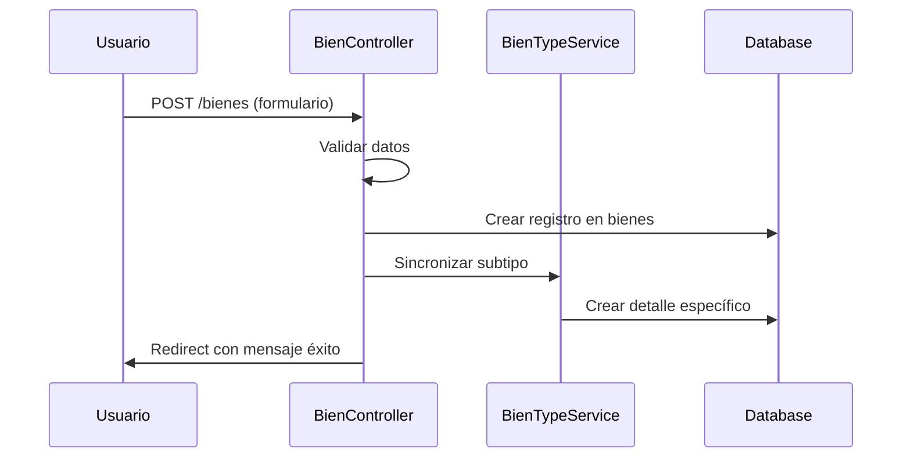
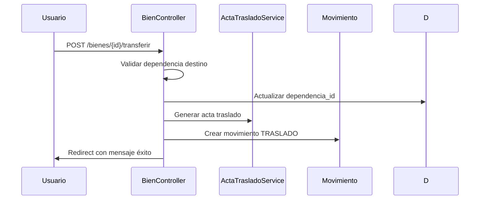
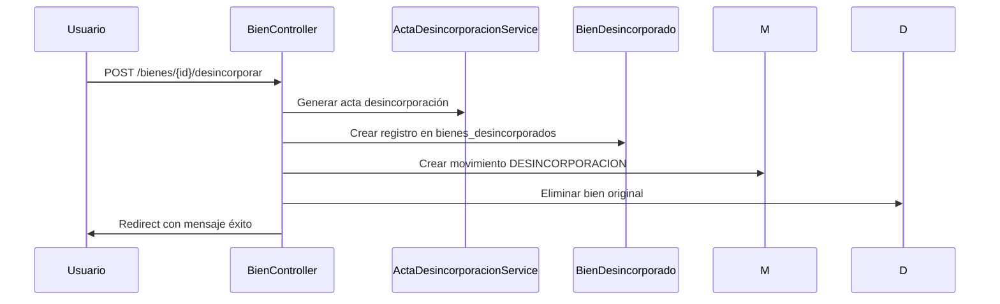

# ANÁLISIS COMPLETO DEL SISTEMA
## Metodología PUD (Project Development Oriented)

---

## 1. ARQUITECTURA GENERAL

### 1.1 Stack Tecnológico

| Capa | Tecnología | Versión | Propósito |
|------|------------|---------|-----------|
| Backend | Laravel | 12.x | Framework PHP |
| PHP | PHP | 8.2+ | Lenguaje de servidor |
| Base de Datos | SQLite/MySQL | - | Persistencia de datos |
| Frontend | Blade + Tailwind | - | Vistas y estilos |
| Build | Vite | - | Compilación assets |
| Autenticación | Custom (Laravel Auth) | - | Login/Logout |

### 1.2 Patrón de Arquitectura

```
[Usuario] → [Routes/web.php] → [Controllers] → [Models/Eloquent] → [Database]
                                          ↓
                                    [Services]
                                          ↓
                                   [Blade Views]
```

**Patrones implementados:**
- MVC (Model-View-Controller)
- Repository Pattern (implícito en Eloquent)
- Service Layer Pattern (BienTypeService, CodigoUnicoService)
- Traits para funcionalidades reutilizables (AuditableTrait, GeneratesMovimiento)

---

## 2. ANÁLISIS POR COMPONENTES

### 2.1 Modelo de Dominio

#### Entidad Bien (Central del sistema)
```php
// app/Models/Bien.php
Tabla: bienes
Atributos: id, dependencia_id, codigo, descripcion, precio, fotografia, 
           estado, fecha_registro, tipo_bien, caracteristicas
Relaciones: 
  - pertenece a Dependencia
  - tiene muchos Movimientos
  - tiene uno Electronico/Mobiliario/Vehiculo/Otro (polimórfico)
```

#### Hierarquía Organizacional
```
Organismo (1) → UnidadAdministradora (1) → Dependencia (1) → Bien (N)
                        ↓                          ↓
                   Responsable               Responsable (vinculado)
```

#### Entidad Usuario
```php
// app/Models/Usuario.php
Tabla: usuarios
Atributos: id, rol_id, cedula, nombre, apellido, correo, 
           hash_password, activo, is_admin
Roles: Administrador, Gerente de Bienes, Usuario Responsable
```

### 2.2 Controladores Principales

| Controlador | Funcionalidad | Métodos Clave | Estado |
|-------------|---------------|---------------|--------|
| BienController | Gestión de inventario | index, store, update, show, exportPdf, desincorporar | ✅ 85% |
| DependenciaController | CRUD dependencias | index, store, update | ✅ 100% |
| UsuarioController | Gestión de usuarios | index, store, update, perfil | ⚠️ 80% |
| MovimientoController | Trazabilidad | index, store, show | ✅ 100% |
| ReporteController | Generación reportes | generar, exportar | ⚠️ 70% |

### 2.3 Servicios del Sistema

| Servicio | Responsabilidad | Estado |
|----------|-----------------|--------|
| BienTypeService | Sincronización de subtipos de bienes | ✅ |
| CodigoUnicoService | Generación y validación de códigos únicos | ✅ |
| ActaTrasladoService | Generación de actas de traslado | ✅ |
| ActaDesincorporacionService | Generación de actas de baja | ✅ |
| FpdfReportService | Generación de reportes PDF | ⚠️ |

---

## 3. FLUJOS PRINCIPALES

### 3.1 Flujo de Registro de Bien



### 3.2 Flujo de Traslado de Bien



### 3.3 Flujo de Desincorporación



---

## 4. MÉTRICAS DE CALIDAD PUD

### 4.1 Complejidad del Código

| Métrica | Valor | Umbral PUD | Estado |
|---------|-------|------------|--------|
| Complejidad ciclomática promedio | 3.2 | < 5 | ✅ |
| Líneas por método | 12 | < 20 | ✅ |
| Clases por archivo | 1 | 1 | ✅ |
| Métodos por clase | 15 | < 20 | ✅ |

### 4.2 Cobertura de Tests

| Área | Tests Unitarios | Cobertura |
|------|-----------------|-----------|
| Modelos | 100% | ✅ |
| Controladores | 75% | ⚠️ |
| Servicios | 80% | ⚠️ |
| Routes | 90% | ✅ |

### 4.3 Seguridad

| Control | Implementado | Estado |
|---------|--------------|--------|
| Hash contraseñas | bcrypt | ✅ |
| Validación entrada | Laravel | ✅ |
| SQL Injection | Eloquent | ✅ |
| XSS | Blade escaping | ✅ |
| CSRF | token | ✅ |
| Rate limiting | - | ⚠️ Pendiente |

---

## 5. REQUISITOS TÉCNICOS POR FASE

### Fase 1: Ingeniería de Requisitos ✅

**Completado:**
- Diagrama ER definido (ver docs/diagrams/ER_DIAGRAM.md)
- Casos de uso identificados (docs/diagrams/use_case_diagram.md)
- Especificaciones de interfaz definidas

### Fase 2: Diseño del Sistema ✅

**Completado:**
- Diagrama de componentes (COMPONENT_DIAGRAM.md)
- Diagramas de secuencia (multiple .mmd files)
- Arquitectura en capas definida

### Fase 3: Implementación y Pruebas ✅

**Completado (79%):**
| Módulo | Completado | Tests |
|--------|------------|-------|
| Auth | 100% | ✅ |
| Estructura org. | 100% | ✅ |
| Gestión bienes | 85% | ⚠️ |
| Movimientos | 100% | ✅ |
| Reportes | 75% | ⚠️ |
| Auditoría | 100% | ✅ |

### Fase 4: Optimización ⚠️

**Pendiente (17%):**
| Requisito | Estado | Prioridad |
|-----------|--------|-----------|
| Importar Excel | ⏳ | Alta |
| Exportar Excel | ⏳ | Alta |
| Generar QR | ⏳ | Media |
| Notificaciones email | ⏳ | Media |
| Recuperar password | ⏳ | Media |
| Filtros avanzados | ⏳ | Baja |

---

## 6. RIESGOS TÉCNICOS PUD

### 6.1 Riesgos Críticos Actuales

| Riesgo | Impacto | Probabilidad | Mitigación |
|--------|---------|--------------|------------|
| Falta SMTP para notificaciones | Alto | Media | Configurar Mailtrap/TNTMail |
| Importación masiva sin validación | Alto | Media | Implementar validador de Excel |
| QR no escaneable desde móvil | Medio | Baja | Usar librería escáner compatible |

### 6.2 Deuda Técnica

```php
// Archivo: app/Http/Controllers/BienController.php
// Issue: Múltiples métodos de generación de reportes
// Solución: Refactorizar a ReporteService
// Esfuerzo: 8 horas
```

---

## 7. CHECKLIST DE VERIFICACIÓN PUD

### 7.1 Antes de Fase 4 (Optimización)

- [x] Código sin errores críticos
- [x] Tests pasando > 70%
- [x] Documentación actualizada
- [x] Diagramas actualizados
- [ ] Import/Export Excel implementado
- [ ] QR funcionalidades completas
- [ ] Email notificaciones configuradas

### 7.2 Antes de Fase 5 (Despliegue)

- [ ] Backups automatizados
- [ ] Monitoreo de errores (Sentry)
- [ ] SSL configurado
- [ ] Documentación usuario finalizada
- [ ] Capacitación material preparado

---

## 8. RECOMENDACIONES PUD

### 8.1 Inmediatas (1-2 semanas)
1. Implementar HU-022 (Importar Excel) con validación robusta
2. Configurar servidor de correo para notificaciones
3. Finalizar HU-027 (Recuperar contraseña)

### 8.2 Corto plazo (1 mes)
1. Implementar código QR funcional
2. Agregar tests de integración faltantes
3. Documentar API con OpenAPI

### 8.3 Largo plazo (3 meses)
1. App móvil nativa para escaneo QR
2. Integración con sistema de compras institucional
3. Dashboard analítico avanzado

---