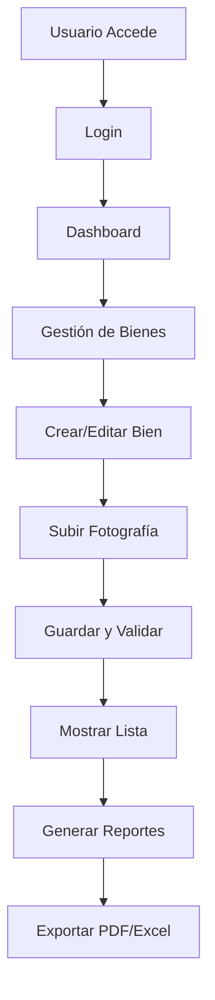

# Explicación del Sistema para el Frontier (Desarrollador Frontend)

## Visión General del Frontend

El frontend del **Sistema de Gestión de Inventario de Bienes** está construido con **Blade templates** de Laravel, estilizado con **Tailwind CSS**, y compilado con **Vite**. Incluye componentes reutilizables, iconos de Heroicons, y soporte para modo oscuro. El objetivo es proporcionar una interfaz intuitiva y responsive para la gestión de inventarios.

### Arquitectura Frontend

- **Framework de Vistas**: Blade (Laravel templating).
- **Estilos**: Tailwind CSS con configuración personalizada (tailwind.config.js).
- **Iconos**: Blade Heroicons package.
- **Build Tool**: Vite para desarrollo y producción.
- **Modo Oscuro**: Implementado con clases de Tailwind.
- **Responsive**: Diseño mobile-first con grid y flexbox.

### Estructura de Vistas

- **Layouts**: `resources/views/layouts/base.blade.php` - Layout principal con navegación, breadcrumbs, y footer.
- **Páginas**: Vistas específicas en `resources/views/` (e.g., `bienes/index.blade.php`, `usuarios/create.blade.php`).
- **Componentes**: `resources/views/components/` - Componentes reutilizables como breadcrumbs, botones, modales.

### Ejemplo de Vista: Crear Bien

```blade
@extends('layouts.base')

@section('title', 'Registrar Bien')

@section('content')
@push('breadcrumbs')
<x-breadcrumbs :items="[['label' => 'Bienes', 'url' => route('bienes.index')], ['label' => 'Nuevo Bien']]" />
@endpush

<div class="max-w-4xl mx-auto">
    <div class="bg-white dark:bg-slate-900 shadow-xl dark:shadow-slate-800 rounded-xl overflow-hidden border border-gray-100 dark:border-slate-700">
        {{-- Encabezado --}}
        <div class="bg-gradient-to-r from-blue-600 to-indigo-700 px-8 py-5">
            <h1 class="text-xl font-bold text-white flex items-center gap-2">
                <x-heroicon-o-cube class="w-5 h-5 text-blue-100" />
                Registrar Nuevo Bien
            </h1>
            <p class="text-blue-100 text-xs mt-1 opacity-90">
                Complete la información técnica y administrativa del activo patrimonial.
            </p>
        </div>

        <form action="{{ route('bienes.store') }}" method="POST" enctype="multipart/form-data" class="p-8 space-y-8">
            @csrf

            {{-- Errores de validación --}}
            @if($errors->any())
                <div class="mb-6 p-4 bg-red-50 border-l-4 border-red-600 text-red-700 rounded-lg">
                    <div class="flex items-center gap-2 mb-2">
                        <x-heroicon-o-exclamation-triangle class="w-5 h-5" />
                        <span class="font-bold">Por favor corrige los siguientes errores:</span>
                    </div>
                    <ul class="text-sm list-disc list-inside space-y-1">
                        @foreach($errors->all() as $error)
                            <li>{{ $error }}</li>
                        @endforeach
                    </ul>
                </div>
            @endif

            {{-- Sección: Asignación Administrativa --}}
            <div class="space-y-4">
                <h2 class="text-lg font-bold text-gray-800 dark:text-gray-200 border-b dark:border-slate-700 pb-2 flex items-center gap-2">
                    <x-heroicon-o-home-modern class="w-5 h-5 text-blue-600 dark:text-blue-400" /> Asignación Administrativa
                </h2>

                <div class="grid grid-cols-1 md:grid-cols-2 gap-6">
                    <div>
                        <label for="dependencia_id" class="block text-sm font-bold text-gray-700 dark:text-gray-300 mb-2">Dependencia <span class="text-red-500">*</span></label>
                        <select name="dependencia_id" id="dependencia_id" required
                            class="w-full px-4 py-3 border border-gray-300 dark:border-gray-600 rounded-lg focus:ring-2 focus:ring-blue-500 outline-none transition bg-white dark:bg-gray-800 text-gray-900 dark:text-gray-100">
                            <!-- Opciones dinámicas -->
                        </select>
                    </div>
                    <!-- Más campos -->
                </div>
            </div>

            {{-- Botones --}}
            <div class="flex justify-end gap-4 pt-6 border-t dark:border-slate-700">
                <a href="{{ route('bienes.index') }}" class="px-6 py-3 bg-gray-200 text-gray-800 rounded-lg hover:bg-gray-300">Cancelar</a>
                <button type="submit" class="px-6 py-3 bg-blue-600 text-white rounded-lg hover:bg-blue-700">Guardar Bien</button>
            </div>
        </form>
    </div>
</div>
@endsection
```

### Componentes Reutilizables

#### Componente: Show Actions

```blade
@php
    $resource = $resource ?? null;
    $model = $model ?? null;
@endphp

<div class="flex items-center justify-between mb-6">
    <div class="flex items-center gap-3">
        <a href="{{ url()->previous() }}" class="inline-flex items-center px-3 py-2 bg-gray-100 text-gray-700 rounded-md hover:bg-gray-200">
            <x-heroicon-o-arrow-left class="w-4 h-4 mr-2"/> Volver
        </a>

        @if(isset($resource) && isset($model))
            @php
                // Resolver parámetro para rutas
                try {
                    $param = app('router')->getRoutes()->getByName($resource . '.edit')
                        ? preg_replace('/.*\{([^}]+)\}.*/', '$1', app('router')->getRoutes()->getByName($resource . '.edit')->uri())
                        : \Illuminate\Support\Str::singular($resource);
                } catch (\Throwable $e) {
                    $param = \Illuminate\Support\Str::singular($resource);
                }

                // URL de edición
                try { $editUrl = route($resource . '.edit', [$param => $model->getKey()]); } catch (\Throwable $e) { $editUrl = null; }

                // URLs de PDF
                $pdfUrl = null;
                $pdfCandidates = [
                    $resource . '.pdf',
                    $resource . '.export.pdf',
                    'reportes.' . $resource . '.pdf'
                ];
                foreach ($pdfCandidates as $candidate) {
                    try {
                        $pdfUrl = route($candidate, [$param => $model->getKey()]);
                        break;
                    } catch (\Throwable $e) {
                        continue;
                    }
                }

                // URL de eliminación
                $deleteUrl = null;
                try { $deleteUrl = route($resource . '.destroy', [$param => $model->getKey()]); } catch (\Throwable $e) { $deleteUrl = null; }
            @endphp

            @if($editUrl)
                <a href="{{ $editUrl }}" class="inline-flex items-center px-3 py-2 bg-blue-100 text-blue-700 rounded-md hover:bg-blue-200">
                    <x-heroicon-o-pencil class="w-4 h-4 mr-2"/> Editar
                </a>
            @endif

            @if($pdfUrl)
                <a href="{{ $pdfUrl }}" target="_blank" class="inline-flex items-center px-3 py-2 bg-green-100 text-green-700 rounded-md hover:bg-green-200">
                    <x-heroicon-o-document class="w-4 h-4 mr-2"/> PDF
                </a>
            @endif

            @if($deleteUrl && (auth()->user()->isAdmin() || auth()->user()->canDeleteData()))
                <form method="POST" action="{{ $deleteUrl }}" class="inline">
                    @csrf
                    @method('DELETE')
                    <button type="submit" class="inline-flex items-center px-3 py-2 bg-red-100 text-red-700 rounded-md hover:bg-red-200"
                            onclick="return confirm('¿Estás seguro de eliminar este registro?')">
                        <x-heroicon-o-trash class="w-4 h-4 mr-2"/> Eliminar
                    </button>
                </form>
            @endif
        @endif
    </div>
</div>
```

### Estilos con Tailwind CSS

- **Configuración**: `tailwind.config.js` incluye colores personalizados, fuentes, y plugins.
- **Modo Oscuro**: Usar clases `dark:` para alternar temas.
- **Responsive**: Utilizar `md:`, `lg:` para breakpoints.
- **Gradientes y Sombras**: Para encabezados y cards.

### Experiencia de Usuario (UX)

- **Navegación**: Sidebar con menú, breadcrumbs para navegación jerárquica.
- **Formularios**: Validación en tiempo real, mensajes de error claros, campos requeridos marcados.
- **Tablas**: Paginación, filtros, búsqueda, acciones en línea.
- **Dashboard**: Gráficos y métricas clave.
- **Accesibilidad**: Labels, focus states, ARIA donde necesario.

### Flujo de Operaciones en Frontend



### Desarrollo y Build

- **Desarrollo**: `npm run dev` o `composer dev` para hot reload.
- **Build**: `npm run build` para producción.
- **Linting**: `vendor/bin/pint` para Blade/PHP.

Esta explicación permite al desarrollador frontend entender y mejorar la interfaz de usuario del sistema.