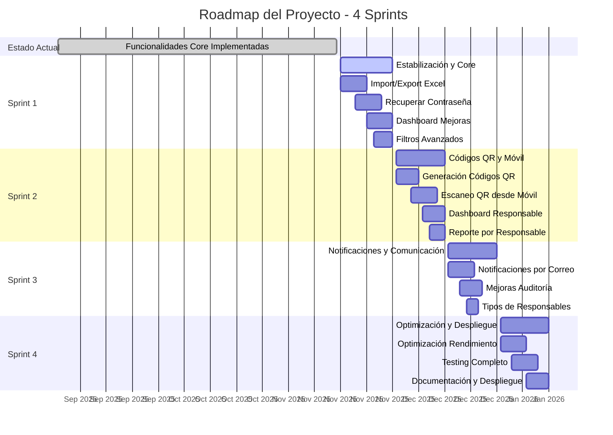

# Explicación del Sistema para el Jefe de Proyecto (Scrum Master / Project Manager)

## Visión General del Proyecto

El **Sistema de Gestión de Inventario de Bienes** es un proyecto Scrum para desarrollar una solución integral de gestión patrimonial para instituciones educativas venezolanas, específicamente UPTOS (Universidades Politécnicas Territoriales). El objetivo es garantizar transparencia, trazabilidad y control total de los bienes públicos, facilitando auditorías y optimizando la administración de activos.

### Contexto y Problema

- **Problema Principal**: Falta de trazabilidad, pérdida de información en registros en papel, auditorías complejas, responsabilidad difusa, movimientos sin registro, falta de evidencia fotográfica, y reportes ineficientes.
- **Impacto**: Riesgo de sanciones, pérdida de bienes, tiempo desperdiciado, imposibilidad de decisiones informadas.
- **Stakeholders**: Administradores, Gerentes de Bienes, Responsables de Dependencias, Auditores.

### Visión del Producto

"Ser la solución integral de gestión patrimonial para instituciones educativas venezolanas que garantice transparencia, trazabilidad y control total de los bienes públicos, facilitando auditorías y optimizando la administración de activos institucionales."

## Metodología Scrum

- **Equipo**: 4 desarrolladores (Backend, Frontend, QA).
- **Duración Sprint**: 2 semanas.
- **Velocidad Estimada**: 35-45 puntos/sprint.
- **Roles**:
  - **Product Owner**: Gerente de Administración.
  - **Scrum Master**: Tú (Jefe de Proyecto), responsable de facilitar el proceso Scrum, remover impedimentos, y asegurar la entrega.
  - **Development Team**: Programador (Backend), Frontier (Frontend), y otros.

## Épicas del Proyecto

1. **E1: Gestión de Estructura Organizacional** - Jerarquía de organismos, unidades y dependencias.
2. **E2: Gestión de Usuarios y Accesos** - Autenticación, roles y permisos.
3. **E3: Gestión de Inventario de Bienes** - Registro, actualización, búsqueda y seguimiento.
4. **E4: Gestión de Movimientos y Trazabilidad** - Control de traslados y cambios.
5. **E5: Reportes y Auditoría** - Generación de reportes y auditoría.
6. **E6: Optimización y Experiencia de Usuario** - Mejoras de rendimiento y usabilidad.

## Product Backlog

El backlog prioriza historias de usuario críticas:

- **Prioridad Crítica (Must Have)**: Registro de usuarios, login, gestión de estructura organizacional, CRUD de bienes, movimientos, reportes básicos.
- **Prioridad Alta (Should Have)**: Import/Export Excel, códigos QR, notificaciones, dashboard avanzado.
- **Prioridad Media (Could Have)**: Optimizaciones, móvil, perfil usuario.
- **Prioridad Baja (Won't Have)**: Funcionalidades futuras.

Ejemplos de HU:
- HU-001: Registro de Usuarios Administradores (5 pts).
- HU-002: Iniciar Sesión (5 pts).
- HU-022: Importar Bienes desde Excel (13 pts).

## Sprint Backlogs y Progreso

### Sprint 1: Fundamentos y Estructura Base (Completado)
- Objetivo: Establecer autenticación, roles y estructura organizacional.
- Story Points: 28.
- Historias: HU-001 a HU-010.
- Estado: ✅ Completado.

### Sprint 2: Códigos QR y Móvil (En Progreso)
- Objetivo: Funcionalidades móviles y trazabilidad.
- Story Points: 34.
- Historias: HU-024 a HU-029.

### Roadmap del Proyecto

## Responsabilidades del Jefe de Proyecto

- **Facilitar Scrum**: Asegurar reuniones diarias, planificación, review y retrospectiva.
- **Remover Impedimentos**: Resolver bloqueos técnicos o de proceso.
- **Gestión de Riesgos**: Monitorear progreso, velocity, burndown charts.
- **Comunicación**: Coordinar con Product Owner y equipo.
- **Calidad**: Asegurar que el Definition of Done se cumpla.

## Métricas y Seguimiento

- **Burndown Chart**: Monitorear progreso del sprint.
- **Velocity**: Puntos completados por sprint.
- **Burnup Chart**: Progreso hacia el producto mínimo viable.

Esta explicación proporciona el contexto de gestión del proyecto, permitiendo al Jefe de Proyecto guiar el equipo hacia la entrega exitosa del sistema.