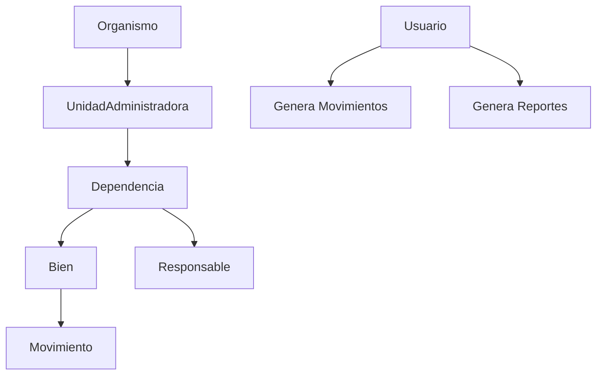

# Explicación del Sistema para el Programador (Desarrollador Backend)

## Visión General del Sistema

El **Sistema de Gestión de Inventario de Bienes** es una aplicación Laravel 12 diseñada para gestionar el inventario de activos institucionales. Utiliza SQLite como base de datos y sigue una jerarquía estricta: Organismo → UnidadAdministradora → Dependencia → Bien.

### Arquitectura Principal

- **Framework**: Laravel 12
- **Base de Datos**: SQLite (database.sqlite)
- **Autenticación**: Custom auth usando tabla `usuarios`, con `correo` como identificador y `hash_password` como campo de contraseña.
- **Vistas**: Blade templates con Tailwind CSS y Vite para el frontend.
- **Directorio Clave**:
  - `app/Models/`: Modelos Eloquent (e.g., Usuario, Bien)
  - `app/Http/Controllers/`: Controladores (e.g., BienController)
  - `routes/web.php`: Rutas
  - `resources/views/`: Vistas Blade
  - `database/migrations/`: Esquemas de BD

### Jerarquía del Sistema

La estructura jerárquica se define así:



- **Organismo**: Entidad superior (e.g., Ministerio).
- **UnidadAdministradora**: Subdivisiones dentro del organismo.
- **Dependencia**: Departamentos dentro de la unidad.
- **Bien**: Activos físicos registrados.
- **Responsable**: Personas a cargo de dependencias.
- **Usuario**: Administradores del sistema.
- **Movimiento**: Cambios en ubicación/estado de bienes.
- **Auditoria**: Registro de cambios.

## Modelos Eloquent

Los modelos siguen convenciones en español, usan `$fillable`, `$casts`, y DocBlocks para relaciones.

### Ejemplo: Modelo Bien

```php
<?php

namespace App\Models;

use App\Enums\EstadoBien;
use App\Enums\TipoBien;
use App\Traits\AuditableTrait;
use Illuminate\Database\Eloquent\Factories\HasFactory;
use Illuminate\Database\Eloquent\Model;

/**
 * Eloquent model Bien.
 *
 * @property int $id
 */
class Bien extends Model
{
    use HasFactory, AuditableTrait;

    protected $table = 'bienes';

    protected $fillable = [
        'dependencia_id',
        'codigo',
        'descripcion',
        'precio',
        'fotografia',
        'estado',
        'fecha_registro',
        'tipo_bien',
        'caracteristicas',
    ];

    public function scopeSearch($query, $term)
    {
        if ($term) {
            $query->where(function ($q) use ($term) {
                $q->where('codigo', 'LIKE', "%{$term}%")
                    ->orWhere('descripcion', 'LIKE', "%{$term}%");
            });
        }
    }

    protected $casts = [
        'fecha_registro' => 'datetime',
        // ...
    ];

    // Relaciones
    public function dependencia()
    {
        return $this->belongsTo(Dependencia::class);
    }

    public function movimientos()
    {
        return $this->hasMany(Movimiento::class);
    }

    // Scopes adicionales...
}
```

- **Traits**: `AuditableTrait` para auditoría, `GeneratesMovimiento` para crear movimientos.
- **Enums**: `EstadoBien` (ACTIVO, DAÑADO, etc.), `TipoBien` (ELECTRONICO, MOBILIARIO, etc.).

### Modelo Usuario

Extiende `Authenticatable`, con campos como `cedula`, `nombre`, `apellido`, `correo`, `hash_password`.

Incluye métodos como `isAdmin()`, `canDeleteData()`.

## Controladores

Usan validación con `$request->validate()`, eager loading con `with()`, y paginación.

### Ejemplo: BienController

```php
class BienController extends Controller
{
    private BienTypeService $bienTypeService;

    public function __construct(BienTypeService $bienTypeService)
    {
        $this->bienTypeService = $bienTypeService;
    }

    public function index(Request $request)
    {
        $validated = $request->validate([
            'search' => ['nullable', 'string', 'max:255'],
            // Validaciones extensas...
        ]);

        $query = Bien::with(['dependencia.unidadAdministradora.organismo']);

        // Aplicar filtros...

        $bienes = $query->paginate(15);

        return view('bienes.index', compact('bienes'));
    }

    // Métodos CRUD: store, update, destroy...
}
```

- **Validación**: Mensajes en español.
- **Servicios**: `BienTypeService` para manejar tipos de bienes, `CodigoUnicoService` para códigos únicos.

## Servicios

Ubicados en `app/Services/`, encapsulan lógica compleja.

- **BienTypeService**: Maneja características específicas por tipo de bien.
- **MovimientoService**: Gestiona creación de movimientos.
- **FpdfReportService**: Genera reportes PDF.
- **ActaDesincorporacionService**: Para desincorporar bienes.

## Migraciones y Base de Datos

Usan `php artisan make:migration`, nombres en español.

Ejemplo: Tabla `bienes` incluye campos como `codigo`, `descripcion`, `precio`, `fotografia`, `estado`, `tipo_bien`, `caracteristicas` (JSON).

Relaciones: Foreign keys para `dependencia_id`, etc.

## Comandos y Testing

- **Comandos**: `composer dev` para desarrollo, `composer test` para tests.
- **Linting**: `vendor/bin/pint`.
- **Tests**: PHPUnit, ejecutar con `php artisan test --filter=TestClassName`.

## Consideraciones Técnicas

- **Permisos**: Verificar `isAdmin()` para acciones administrativas.
- **Auditoría**: Todos los cambios se registran en `auditoria`.
- **Carga Eager**: Usar `with()` para evitar N+1 queries.
- **Validación**: En controladores, con reglas específicas.
- **Exportación**: Usa `BienesExport` para Excel.

Esta explicación cubre los aspectos técnicos clave para que el programador backend pueda entender y contribuir al código.