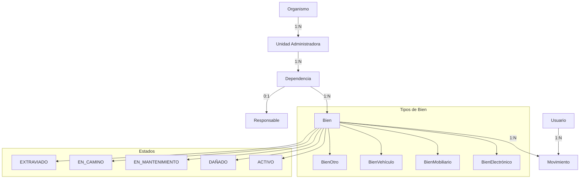

# Estructura de Video Conferencia - Sistema de Gestión de Inventario de Bienes (IUT)

## Descripción General

Este documento presenta una estructura detallada para una video conferencia de presentación del Sistema de Gestión de Inventario de Bienes (IUT) a un equipo de 3 personas que utiliza metodología Scrum.

---

## 1. Distribución de Tiempo por Sección

| # | Sección | Tiempo Asignado | Porcentaje |
|---|---------|-----------------|------------|
| 1 | Introducción y Bienvenida | 3 min | 7.5% |
| 2 | Visión General del Sistema | 5 min | 12.5% |
| 3 | Arquitectura Técnica | 8 min | 20% |
| 4 | Jerarquía y Modelos de Datos | 7 min | 17.5% |
| 5 | Funcionalidades Principales | 10 min | 25% |
| 6 | Demo en Vivo | 5 min | 12.5% |
| 7 | Relación con Scrum | 2 min | 5% |
| 8 | Q&A y Cierre | 5 min | 12.5% |
| | **Total** | **45 min** | **100%** |

---

## 2. Roles para los 3 Participantes

### Participante A: Líder Técnico / Scrum Master
**Responsabilidades:**
- Presentación de Arquitectura Técnica
- Explicación de la estructura de base de datos
- Manejo de la demo técnica
- Preguntas técnicas avanzadas

### Participante B: Product Owner / Analista Funcional
**Responsabilidades:**
- Visión general del sistema
- Jerarquía Organismo → Unidad → Dependencia → Bien
- Casos de uso y flujos principales
- Gestión de estados y tipos de bienes

### Participante C: Desarrollador / Equipo Técnico
**Responsabilidades:**
- Funcionalidades principales (movimientos, auditoría, reportes)
- Import/Export Excel y códigos QR
- Relación con metodología Scrum
- Demo de casos específicos

---

## 3. Contenido Específico por Sección

### Sección 1: Introducción y Bienvenida (3 min)

**Contenido:**
- Saludo formal al equipo Scrum
- Presentación de los 3 ponentes y sus roles
- Propósito de la reunión: presentar el sistema IUT
- Agenda rápida de la presentación

**Puntos Clave:**
- [] Agradecimiento por la oportunidad de presentar
- [] Breve mención de los 6 sprints completados
- [] Expectativas de la sesión (conocimiento del sistema, no entrenamiento detallado)

---

### Sección 2: Visión General del Sistema (5 min)

**Contenido:**
- Qué es el Sistema de Gestión de Inventario de Bienes
- Propósito: gestión patrimonial de bienes institucionales
- Para quién está diseñado: personal administrativo, responsables patrimoniales
- Contexto: Universidad Politécnica Territorial de Oriente (UPTOS)

**Puntos Clave:**
- [] Sistema desarrollado en Laravel 12 con mysql
- [] Objetivo principal: trazabilidad completa de bienes
- [] Diferenciadores: códigos QR, import/export Excel, auditoría completa

---

### Sección 3: Arquitectura Técnica (8 min)

**Contenido (Presentado por Participante A):**
- Stack tecnológico: Laravel 12, Mysql, Blade, Tailwind CSS, Vite
- Estructura de capas: Presentación → Controlador → Modelo → Servicios
- Componentes principales:
  - Controladores (Auth, Bien, Movimiento, Reporte, etc.)
  - Modelos (Organismo, Unidad, Dependencia, Bien, etc.)
  - Servicios (CodigoUnico, ActaDesincorporacion, FpdfReport, etc.)
- Arquitectura de autenticación personalizada (tabla `usuarios`, campo `correo`)

**Diagrama de Arquitectura:**

```
┌─────────────────────────────────────────────┐
│              CLIENTE (Navegador)            │
│         Blade Templates + Tailwind CSS     │
└────────────────────┬────────────────────────┘
                     │ HTTP
┌────────────────────▼────────────────────────┐
│           LARAVEL APPLICATION               │
│  ┌─────────────────────────────────────────┐ │
│  │         CAPA DE CONTROLADORES          │ │
│  │  BienController | MovimientoController  │ │
│  │  ReporteController | UsuarioController  │ │
│  └────────────────────┬────────────────────┘ │
│                       │                       │
│  ┌────────────────────▼────────────────────┐ │
│  │         CAPA DE MODELOS (Dominio)       │ │
│  │  Organismo | Unidad | Dependencia | Bien│ │
│  └────────────────────┬────────────────────┘ │
│                       │                       │
│  ┌────────────────────▼────────────────────┐ │
│  │            SERVICIOS                     │ │
│  │  CodigoUnico | Movimiento | Reporte     │ │
│  └────────────────────┬────────────────────┘ │
└──────────────────────┼───────────────────────┘
                       │
┌──────────────────────▼───────────────────────┐
│              MYsql Database                  │
│   Bienes | Movimientos | Auditoría | Usuarios│
└───────────────────────────────────────────────┘
```

**Puntos Clave:**
- [] Laravel 12 como framework principal con PHP 8.2+
- [] Arquitectura MVC con servicios especializados
- [] Base de datos Mysql para portabilidad
- [] Personalización de autenticación (sin Laravel Breeze/UI)

---

### Sección 4: Jerarquía y Modelos de Datos (7 min)

**Contenido (Presentado por Participante B):**
- Jerarquía principal: Organismo → UnidadAdministradora → Dependencia → Bien
- Modelo de Responsable (asignado a dependencias)
- Modelo de Usuario (del sistema)
- Tipos de bienes (STI - Single Table Inheritance):
  - BienElectronico
  - BienMobiliario
  - BienVehiculo
  - BienOtro
- Estados de bienes: ACTIVO, DAÑADO, EN_MANTENIMIENTO, EN_CAMINO, EXTRAVIADO

**Diagrama de Jerarquía:**



**Puntos Clave:**
- [] La jerarquía es estricta: cada bien pertenece a una dependencia
- [] Los tipos de bienes tienen campos específicos (procesador, memoria para electrónicos)
- [] Los estados permiten seguimiento del ciclo de vida completo

---

### Sección 5: Funcionalidades Principales (10 min)

**Contenido (Presentado por Participante C):**

#### 5.1 Gestión de Bienes (2 min)
- CRUD completo de bienes
- Asignación a dependencias
- Códigos únicos automáticos (CodigoUnicoService)
- Fotografías y características específicas

#### 5.2 Movimientos y Trazabilidad (3 min)
- Registro de movimientos (traslado, asignación, desincorporación)
- Historial completo por bien
- Estados transicionales
- Actas de traslado y desincorporación

#### 5.3 Auditoría (2 min)
- Registro automático de operaciones (AuditableTrait)
- Seguimiento de cambios en bienes
- Trazabilidad completa de acciones
- Auditoría por usuario, fecha, entidad

#### 5.4 Reportes (2 min)
- Generación de PDFs con FpdfReportService
- Reportes por dependencia, unidad, organismo
- Filtros por estado, tipo, fechas
- Exportación a Excel (PhpSpreadsheet)

#### 5.5 Funcionalidades Extra (1 min)
- Códigos QR por bien
- Import/Export Excel masivo
- Papelera de eliminados
- Búsqueda global

**Puntos Clave:**
- [] Sistema integral que cubre todo el ciclo de vida de un bien
- [] Auditoría automática sin intervención del usuario
- [] Exportación flexible para externos

---

### Sección 6: Demo en Vivo (5 min)

**Contenido (Presentado por Participante A con participación de C):**

**Demo 1: Registro de un Bien (1 min)**
- Mostrar formulario de creación
- Seleccionar tipo (electrónico, mobiliario)
- Asignar a dependencia
- Generar código único

**Demo 2: Realizar un Movimiento (1.5 min)**
- Seleccionar un bien existente
- Crear movimiento de traslado
- Cambiar estado
- Verificar historial

**Demo 3: Generar un Reporte (1.5 min)**
- Seleccionar filtros (dependencia, estado)
- Generar PDF
- Exportar a Excel

**Demo 4: Códigos QR (1 min)**
- Mostrar código QR de un bien
- Explicar utilidad física

**Sugerencias de Demostración:**
- [] Usar datos de prueba (seeders) para la demo
- [] Tener preparados escenarios específicos antes de la llamada
- [] Grabar la demo previamente como respaldo
- [] Tener pantalla de login lista como backup si falla la demo en vivo

---

### Sección 7: Relación con Scrum (2 min)

**Contenido (Presentado por Participante B):**

El sistema IUT fue desarrollado utilizando metodología Scrum con las siguientes características:

#### 7.1 Historial de Sprints (Presupuestar 6 sprints completados)

| Sprint | Objetivo Principal | Funcionalidades Entregadas |
|--------|---------------------|----------------------------|
| 1 | Setup y Base | Estructura Laravel, modelos, migraciones |
| 2 | Autenticación | Login, roles, permisos |
| 3 | Gestión de Jerarquía | CRUD Organismo, Unidad, Dependencia |
| 4 | Gestión de Bienes | CRUD bienes, tipos, estados, códigos QR |
| 5 | Movimientos y Auditoría | Registro de movimientos, historial, auditoría |
| 6 | Reportes y Export | PDFs, Excel, importación masiva |

#### 7.2 Artefactos Scrum en el Proyecto

- **Product Backlog**: Funcionalidades priorizadas del sistema
- **Sprint Backlogs**: Tareas por sprint
- **Diagramas de Burndown**: Seguimiento de velocidad
- **Definition of Done**: Criterios de aceptación

#### 7.3 Relación con el Equipo Actual

- El sistema puede integrarse en el workflow del equipo
- Backlog de mejoras y bugs pendientes
- Sprints futuros para nuevas funcionalidades (API REST, app móvil, etc.)

**Puntos Clave:**
- [] El sistema fue construido usando las mismas prácticas que el equipo usa actualmente
- [] Existe documentación de sprints y backlog disponible
- [] Hay espacio para mejoras y expansión en sprints futuros

---

### Sección 8: Q&A y Cierre (5 min)

**Contenido:**
- Abrir espacio para preguntas
- Aclarar dudas sobre funcionalidades
- Recoger feedback inicial
- Próximos pasos: documentación, training, soporte

**Preguntas Frecuentes Anticipadas:**
- ¿Cómo se manejan los bienes desincorporados?
- ¿El sistema soporta múltiples organismos?
- ¿Hay límite en el número de bienes?
- ¿Cómo funciona la auditoría en tiempo real?
- ¿Qué pasa si se elimina un bien por error?

---

## 4. Flujo de la Presentación

```
┌─────────────────────────────────────────────────────────────────┐
│                    FLUJO DE PRESENTACIÓN                        │
└─────────────────────────────────────────────────────────────────┘

[0:00 - 0:03] INTRODUCCIÓN
              └── Bienvenida y presentación de roles

[0:03 - 0:08] VISIÓN GENERAL
              └── Qué es, para quién, contexto

[0:08 - 0:16] ARQUITECTURA TÉCNICA
              └── Stack, capas, componentes

[0:16 - 0:23] JERARQUÍA Y DATOS
              └── Modelos, relaciones, tipos, estados

[0:23 - 0:33] FUNCIONALIDADES
              └── Bienes, movimientos, auditoría, reportes, extras

[0:33 - 0:38] DEMO EN VIVO
              └── Registrar bien, mover, reportar, QR

[0:38 - 0:40] SCRUM
              └── Historial de sprints, artefactos

[0:40 - 0:45] Q&A Y CIERRE
              └── Preguntas, feedback, próximos pasos
```

---

## 5. Checklist de Preparación

### Antes de la Video Conferencia

- [ ] Confirmar asistencia de los 3 participantes
- [ ] Compartir link de la reunión
- [ ] Preparar diapositivas de apoyo (opcional)
- [ ] Verificar conexión a internet
- [ ] Probar herramientas de pantalla compartida
- [ ] Verificar que la aplicación esté corriendo (composer dev)
- [ ] Preparar datos de prueba para demo
- [ ] Grabar demo previamente como respaldo
- [ ] Tener documentos de referencia a mano (LOGICA_SISTEMA.txt, README.md)

### Materiales de Apoyo

- [ ] Diagrama de arquitectura
- [ ] Diagrama de jerarquía
- [ ] Capturas de pantalla del sistema
- [ ] Acceso a código fuente si se requiere mostrar
- [ ] Documentación del proyecto (PDFs de visión, backlog, sprints)

### Durante la Presentación

- [ ] Presentador A: Controla el tiempo y la estructura
- [ ] Presentador B: Comparte pantalla para slides/diagramas
- [ ] Presentador C: Realiza la demo y responde preguntas técnicas

---

## 6. Puntos Clave por Sección (Resumen)

### Introducción
- Agradecimiento y presentación de roles
- Mención de los 6 sprints completados

### Visión General
- Sistema de gestión patrimonial
- Laravel 12 + SQLite
- Diferenciadores: QR, Excel, auditoría

### Arquitectura
- Stack: Laravel 12, Blade, Tailwind, Vite
- Capas: Controlador → Modelo → Servicios
- Auth personalizada con tabla `usuarios`

### Jerarquía
- Organismo → Unidad → Dependencia → Bien
- Tipos: Electrónico, Mobilitario, Vehículo, Otro
- Estados: ACTIVO, DAÑADO, EN_MANTENIMIENTO, EN_CAMINO, EXTRAVIADO

### Funcionalidades
- CRUD bienes con códigos únicos
- Movimientos con historial completo
- Auditoría automática
- Reportes PDF y Excel
- Import/Export masivo, códigos QR

### Demo
- Registrar bien → Realizar movimiento → Generar reporte → Mostrar QR

### Scrum
- 6 sprints de desarrollo
- Artefactos disponibles (backlog, burndown)
- Listo para integración con el workflow actual

---

## 7. Notas Adicionales

### Sugerencias de Comunicación
- Usar lenguaje accesible para todos los roles
- Evitar tecnicismos excesivos sin explicación
- Hacer pausas para preguntas frecuentes
- Confirmar entendimiento antes de avanzar

### Manejo de Tiempo
- Si la sección se alarga, reducir demo o Q&A
- Tener un "plan B" si la demo falla (screenshots)
- Asignar un "timekeeper" entre los participantes

### Documentación de Seguimiento
- Enviar recording de la reunión después
- Compartir link a documentación del sistema
- Crear lista de mejoras identificadas
- Planificar sesión de Q&A adicional si es necesario

---

*Documento preparado para equipo de 3 personas usando metodología Scrum*
*Duración total estimada: 45 minutos*