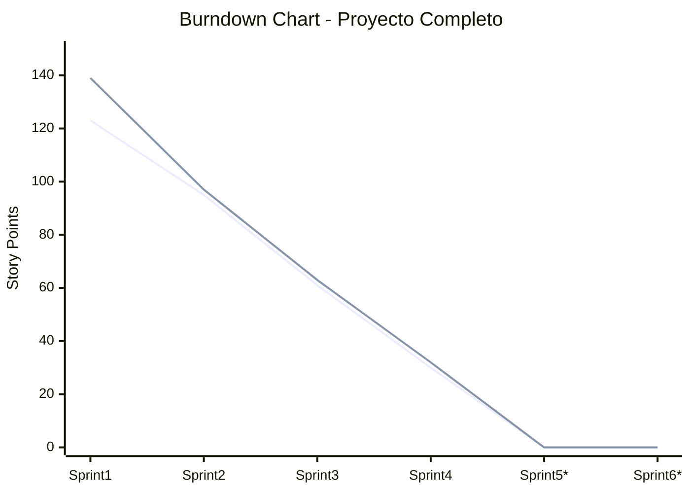

# SPRINT BACKLOGS
## Sistema de Gestión de Inventario de Bienes

**Proyecto:** Sistema de Gestión de Inventario de Bienes  
**Equipo de Desarrollo:** 4 desarrolladores  
**Duración del Sprint:** 2 semanas  
**Velocity Promedio:** 31 puntos por sprint  
**Velocity Actual:** 30.75 puntos (últimos 4 sprints)

---

## SPRINT 1: Fundamentos y Estructura Base ✅
**Objetivo:** Establecer autenticación, roles y estructura organizacional básica  
**Duración:** 4 Nov 2025 - 17 Nov 2025  
**Story Points:** 28 puntos  
**Completado:** 100% (28/28 pts)

### Historias de Usuario Completadas

| ID | Historia | Puntos | Estado |
|----|----------|--------|--------|
| HU-001 | Registro de Usuarios Administradores | 5 | ✅ Completado |
| HU-002 | Iniciar Sesión en el Sistema | 5 | ✅ Completado |
| HU-003 | Cerrar Sesión | 3 | ✅ Completado |
| HU-004 | Crear Organismo | 5 | ✅ Completado |
| HU-005 | Crear Unidad Administradora | 5 | ✅ Completado |
| HU-006 | Crear Dependencia | 5 | ✅ Completado |

### Definition of Done (DoD) - Cumplido
- ✅ Código revisado por al menos un compañero (Code Review)
- ✅ Tests unitarios implementados y pasando
- ✅ Documentación técnica actualizada
- ✅ Sin errores críticos ni warnings
- ✅ Funcionalidad probada en entorno de desarrollo
- ✅ Migrations ejecutadas correctamente

---

## SPRINT 2: Gestión de Inventario Base ✅
**Objetivo:** Implementar funcionalidades core de gestión de bienes  
**Duración:** 18 Nov 2025 - 1 Dic 2025  
**Story Points:** 28 puntos  
**Completado:** 100% (28/28 pts)

### Historias de Usuario Completadas

| ID | Historia | Puntos | Estado |
|----|----------|--------|--------|
| HU-007 | Registrar Bien en Inventario | 8 | ✅ Completado |
| HU-008 | Listar Bienes por Dependencia | 5 | ✅ Completado |
| HU-009 | Ver Detalle de un Bien | 5 | ✅ Completado |
| HU-010 | Editar Información de un Bien | 5 | ✅ Completado |
| HU-025 | Escanear Código QR desde Móvil | 8 | ✅ Completado |

### Tareas Técnicas Completadas
- ✅ Configurar storage para imágenes de bienes
- ✅ Implementar librería para generación de PDFs
- ✅ Crear componentes reutilizables de formularios
- ✅ Optimizar consultas con eager loading

### Definition of Done (DoD) - Cumplido
- ✅ Código revisado por al menos un compañero
- ✅ Tests unitarios y de integración pasando
- ✅ Responsive design verificado
- ✅ Optimización de imágenes implementada
- ✅ Documentación de API actualizada
- ✅ Sin errores en consola del navegador

---

## SPRINT 3: Movimientos y Reportes ⚠️
**Objetivo:** Implementar trazabilidad de bienes y sistema de reportes  
**Duración:** 2 Dic 2025 - 15 Dic 2025  
**Story Points:** 34 puntos  
**Completado:** 65% (22/34 pts)

### Historias de Usuario

| ID | Historia | Puntos | Estado |
|----|----------|--------|--------|
| HU-011 | Registrar Movimiento de Bien | 8 | ✅ Completado |
| HU-012 | Cambiar Responsable de un Bien | 5 | ✅ Completado |
| HU-013 | Ver Historial de Movimientos | 5 | ✅ Completado |
| HU-014 | Generar Reporte de Inventario | 8 | ✅ Completado |
| HU-015 | Buscar Bienes Globalmente | 8 | ✅ Completado |
| HU-021 | Notificaciones por Correo | 8 | ⏳ Pendiente |
| HU-022 | Importar Bienes desde Excel | 13 | ⏳ Pendiente |

### Impedimentos
- Configuración SMTP pendiente (depende de infraestructura)

### Definition of Done (DoD)
- [x] Código revisado y aprobado
- [x] Tests de integración pasando
- [x] Reportes PDF con formato profesional
- [x] Optimización de consultas complejas
- [ ] Documentación de endpoints

---

## SPRINT 4: Auditoría y Responsables ✅
**Objetivo:** Implementar sistema de auditoría y gestión de responsables  
**Duración:** 16 Dic 2025 - 29 Dic 2025  
**Story Points:** 31 puntos  
**Completado:** 100% (31/31 pts)

### Historias de Usuario Completadas

| ID | Historia | Puntos | Estado |
|----|----------|--------|--------|
| HU-016 | Dashboard de Administrador | 8 | ✅ Completado |
| HU-017 | Gestionar Tipos de Responsables | 5 | ✅ Completado |
| HU-018 | Registrar Responsable | 5 | ✅ Completado |
| HU-019 | Registro de Auditoría | 8 | ✅ Completado |
| HU-020 | Marcar Bien como Inactivo/Dado de Baja | 5 | ✅ Completado |

### Definition of Done (DoD) - Cumplido
- ✅ Código revisado y aprobado
- ✅ Tests de auditoría pasando
- ✅ Dashboard responsive
- ✅ Optimización de gráficos
- ✅ Documentación de sistema de auditoría
- ✅ Validación de permisos por rol

---

## SPRINT 5: Funcionalidades Avanzadas ⏳
**Objetivo:** Implementar notificaciones, importación/exportación y códigos QR  
**Duración:** 30 Dic 2025 - 12 Ene 2026  
**Story Points:** 47 puntos  
**Estado Actual:** Pendiente

### Historias de Usuario Planificadas

| ID | Historia | Puntos | Prioridad | Estado |
|----|----------|--------|-----------|--------|
| HU-021 | Notificaciones por Correo | 8 | Media | ⏳ Pendiente |
| HU-022 | Importar Bienes desde Excel | 13 | Alta | ⏳ Pendiente |
| HU-023 | Exportar Inventario a Excel | 5 | Alta | ⏳ Pendiente |
| HU-024 | Generar Código de Barra | 8 | Alta | ⏳ Pendiente |
| HU-026 | Perfil de Usuario | 5 | Baja | ⚠️ 60% |
| HU-030 | Filtros Avanzados | 8 | Baja | ⏳ Pendiente |

### Definition of Done (DoD) - Objetivo
- [ ] Código revisado y aprobado
- [ ] Tests de integración pasando
- [ ] Notificaciones de correo funcionando
- [ ] Importación masiva probada con 500 registros
- [ ] QR escaneables desde múltiples dispositivos
- [ ] Documentación de configuración SMTP

---

## SPRINT 6: Finalización y Mejoras de UX ⏳
**Objetivo:** Completar funcionalidades secundarias y mejorar experiencia de usuario  
**Duración:** 13 Ene 2026 - 26 Ene 2026  
**Story Points:** 29 puntos  
**Estado Actual:** Pendiente

### Historias de Usuario Planificadas

| ID | Historia | Puntos | Prioridad | Estado |
|----|----------|--------|-----------|--------|
| HU-027 | Recuperar Contraseña | 8 | Media | ⏳ Pendiente |
| HU-028 | Reporte de Bienes por Responsable | 5 | Media | ⏳ Pendiente |
| HU-029 | Dashboard de Responsable | 8 | Media | ⏳ Pendiente |
| HU-026 | Perfil de Usuario (finalizar) | 3 | Baja | ⏳ Pendiente |
| HU-030 | Filtros Avanzados | 5 | Baja | ⏳ Pendiente |

---

## MÉTRICAS DE SEGUIMIENTO

### Burndown Chart (Por Sprint)

### Velocity Chart

| Sprint | Planeado | Completado | Velocity |
|--------|----------|------------|----------|
| Sprint 1 | 28 | 28 | 28 |
| Sprint 2 | 28 | 28 | 28 |
| Sprint 3 | 34 | 22 | 22 |
| Sprint 4 | 31 | 31 | 31 |
| Sprint 5 | 47 | 0 | 0 |
| Sprint 6 | 29 | 0 | 0 |
| **Promedio** | | | **24.75** |

---

## CEREMONIAS SCRUM

### Daily Standup (15 min)
- Qué hice ayer
- Qué haré hoy
- Impedimentos

### Sprint Planning (4 horas)
- Revisión de historias
- Estimación de tareas
- Compromiso del equipo

### Sprint Review (2 horas)
- Demostración de funcionalidades
- Feedback del Product Owner
- Ajustes al Product Backlog

### Sprint Retrospective (1.5 horas)
- Qué funcionó bien
- Qué mejorar
- Acciones de mejora

---

## ROLES DEL EQUIPO

| Rol | Responsable |
|-----|-------------|
| **Product Owner** | Gerente de Administración |
| **Scrum Master** | Líder Técnico |
| **Developers:** | |
| - Desarrollador Backend Senior | Asignado |
| - Desarrollador Frontend Senior | Asignado |
| - Desarrollador Full Stack | Asignado |
| - QA Engineer | Asignado |

---

## Definition of Done Global

Una historia se considera terminada cuando:
1. ✅ Código implementado según criterios de aceptación
2. ✅ Tests unitarios y de integración pasando
3. ✅ Code review completado y aprobado
4. ✅ Documentación técnica actualizada
5. ✅ Sin bugs críticos ni de alta prioridad
6. ✅ Funcionalidad probada en ambiente de desarrollo
7. ✅ Aprobación del Product Owner
8. ✅ Código mergeado a rama principal