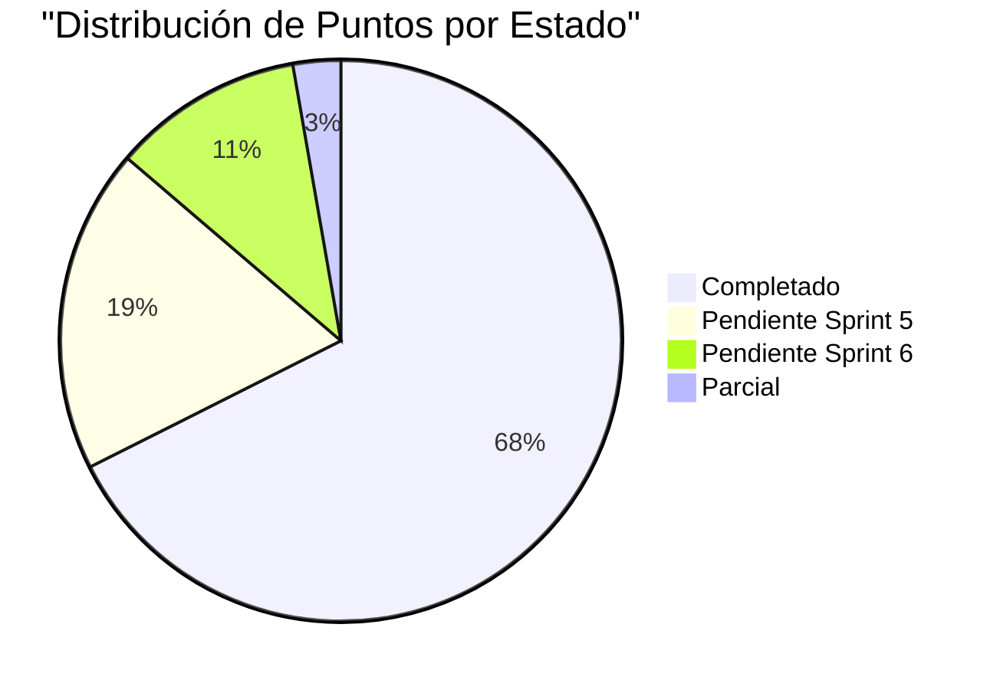

# ROADMAP
## Sistema de Gestión de Inventario de Bienes

| Campo | Valor |
|-------|-------|
| **Producto** | Sistema de Gestión de Inventario de Bienes |
| **Equipo** | 4 desarrolladores |
| **Duración Sprint** | 2 semanas |
| **Total Sprints** | 6 |
| **Total Puntos** | 197 |
| **Completado** | 123 pts (62.4%) |
| **Pendiente** | 74 pts (37.6%) |

---

## Fases del Proyecto

### Fase 1: MVP - Fundamentos ✅
**Período:** Nov 2025 - Dic 2025

| Sprint | Enfoque | Puntos | Completado | % |
|--------|---------|--------|------------|-----|
| Sprint 1 | Autenticación, Roles, Estructura Organizacional | 28 | 28 | 100% |
| Sprint 2 | Gestión de Bienes (CRUD, Fotos, Búsqueda) | 28 | 28 | 100% |
| **Subtotal** | | **56** | **56** | **100%** |

---

### Fase 2: Trazabilidad ✅
**Período:** Dic 2025 - Ene 2026

| Sprint | Enfoque | Puntos | Completado | % |
|--------|---------|--------|------------|-----|
| Sprint 3 | Movimientos, Reportes, Auditoría | 34 | 22 | 65% |
| Sprint 4 | Dashboard Admin, Responsables | 31 | 31 | 100% |
| **Subtotal** | | **65** | **53** | **81.5%** |

---

### Fase 3: Optimización ⏳
**Período:** Ene 2026 - Feb 2026

| Sprint | Enfoque | Puntos | Completado | % |
|--------|---------|--------|------------|-----|
| Sprint 5 | QR, Excel, Notificaciones, Perfil | 47 | 8 | 17% |
| Sprint 6 | Password Recovery, Dashboard Responsable | 29 | 0 | 0% |
| **Subtotal** | | **76** | **8** | **10.5%** |

---

## Diagrama de Gantt

```mermaid
gantt
    title Roadmap del Proyecto - 6 Sprints
    dateFormat  YYYY-MM-DD
    axisFormat  %b %Y

    section Fase 1: Fundamentos
    Sprint 1: Autenticación y Estructura :done, s1, 2025-11-04, 2025-11-17
    Sprint 2: Gestión de Inventario :done, s2, 2025-11-18, 2025-12-01

    section Fase 2: Trazabilidad
    Sprint 3: Movimientos y Reportes :done, s3, 2025-12-02, 2025-12-15
    Sprint 4: Auditoría y Responsables :done, s4, 2025-12-16, 2025-12-29

    section Fase 3: Optimización
    Sprint 5: Funcionalidades Avanzadas :active, s5, 2025-12-30, 2026-01-12
    Sprint 6: Finalización : s6, 2026-01-13, 2026-01-26
```

---

## Distribución de Funcionalidades por Sprint

### Sprint 1: Fundamentos y Estructura Base (28 pts) ✅

| ID | Historia | Puntos | Estado |
|----|----------|--------|--------|
| HU-001 | Registro de Usuarios Administradores | 5 | ✅ |
| HU-002 | Iniciar Sesión en el Sistema | 5 | ✅ |
| HU-003 | Cerrar Sesión | 3 | ✅ |
| HU-004 | Crear Organismo | 5 | ✅ |
| HU-005 | Crear Unidad Administradora | 5 | ✅ |
| HU-006 | Crear Dependencia | 5 | ✅ |

---

### Sprint 2: Gestión de Inventario Base (28 pts) ✅

| ID | Historia | Puntos | Estado |
|----|----------|--------|--------|
| HU-007 | Registrar Bien en Inventario | 8 | ✅ |
| HU-008 | Listar Bienes por Dependencia | 5 | ✅ |
| HU-009 | Ver Detalle de un Bien | 5 | ✅ |
| HU-010 | Editar Información de un Bien | 5 | ✅ |
| HU-025 | Escanear Código QR desde Móvil | 8 | ✅ |

---

### Sprint 3: Movimientos y Reportes (34 pts) ⚠️

| ID | Historia | Puntos | Estado |
|----|----------|--------|--------|
| HU-011 | Registrar Movimiento de Bien | 8 | ✅ |
| HU-012 | Cambiar Responsable de un Bien | 5 | ✅ |
| HU-013 | Ver Historial de Movimientos | 5 | ✅ |
| HU-014 | Generar Reporte de Inventario | 8 | ✅ |
| HU-015 | Buscar Bienes Globalmente | 8 | ✅ |
| HU-021 | Notificaciones por Correo | 8 | ⏳ |
| HU-022 | Importar Bienes desde Excel | 13 | ⏳ |

---

### Sprint 4: Auditoría y Responsables (31 pts) ✅

| ID | Historia | Puntos | Estado |
|----|----------|--------|--------|
| HU-016 | Dashboard de Administrador | 8 | ✅ |
| HU-017 | Gestionar Tipos de Responsables | 5 | ✅ |
| HU-018 | Registrar Responsable | 5 | ✅ |
| HU-019 | Registro de Auditoría | 8 | ✅ |
| HU-020 | Marcar Bien como Inactivo/Dado de Baja | 5 | ✅ |

---

### Sprint 5: Funcionalidades Avanzadas (47 pts) ⏳

| ID | Historia | Puntos | Estado |
|----|----------|--------|--------|
| HU-021 | Notificaciones por Correo | 8 | ⏳ (mover a Sprint 6) |
| HU-022 | Importar Bienes desde Excel | 13 | ⏳ |
| HU-023 | Exportar Inventario a Excel | 5 | ⏳ |
| HU-024 | Generar Código QR | 8 | ⏳ |
| HU-026 | Perfil de Usuario | 5 | ⚠️ |

---

### Sprint 6: Finalización y Mejoras de UX (29 pts) ⏳

| ID | Historia | Puntos | Estado |
|----|----------|--------|--------|
| HU-021 | Notificaciones por Correo | 8 | ⏳ |
| HU-027 | Recuperar Contraseña | 8 | ⏳ |
| HU-028 | Reporte de Bienes por Responsable | 5 | ⏳ |
| HU-029 | Dashboard de Responsable | 8 | ⏳ |

---

## Resumen de Puntos



---

## Funcionalidades por Estado

| Estado | Cantidad | Puntos | Porcentaje |
|--------|----------|--------|------------|
| ✅ Completado | 20 | 123 | 62.4% |
| ⏳ Pendiente | 10 | 74 | 37.6% |
| ⚠️ Parcial | 1 | 5 | 2.6% |

---

## Próximos Pasos Critico

### Semana 1-2: Sprint 5A - Import/Export Excel
- Prioridad máxima: HU-022 (Importar Bienes desde Excel - 13 pts)
- HU-023 (Exportar a Excel - 5 pts)

### Semana 3: Sprint 5B - QR y Códigos
- HU-024 (Generar Código QR - 8 pts)

### Semana 4: Sprint 6 - Finalización
- HU-027 (Recuperar Contraseña - 8 pts)
- HU-028 (Reporte por Responsable - 5 pts)