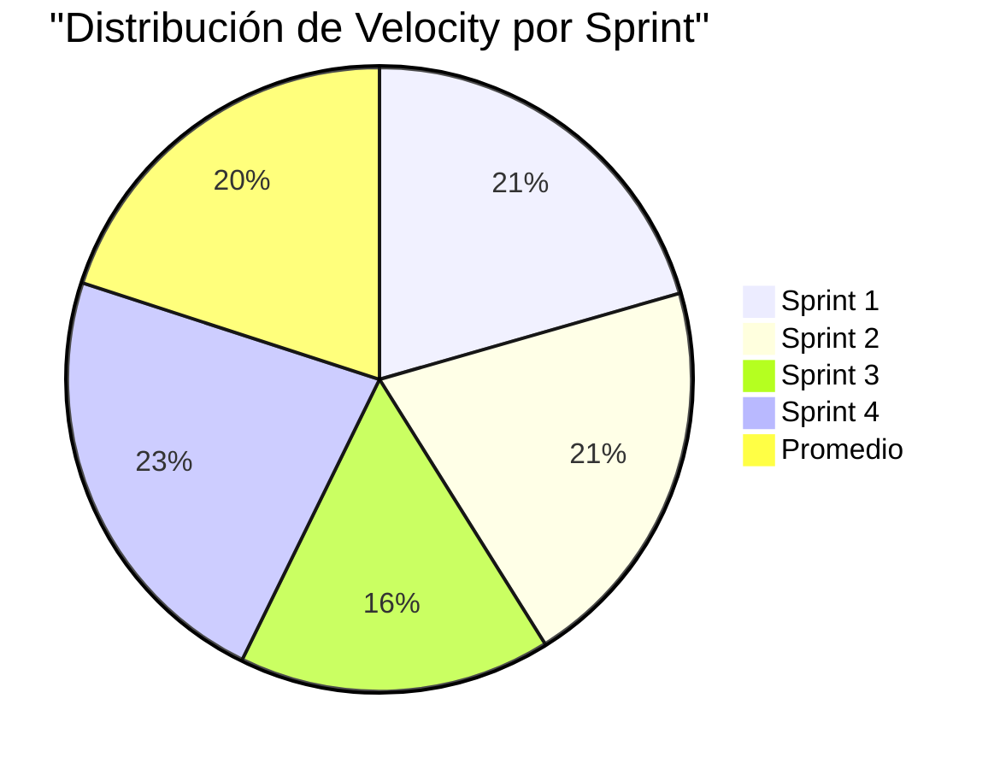
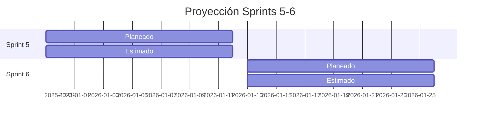

```mermaid
gantt
    title Sprint 2 - Burndown Diario
    dateFormat  X
    axisFormat %d
    
    section Puntos Restantes
    Ideal : 0, 28, 14
    Real : 28, 0, 14
```

# BURNDOWN CHART
## Sistema de Gestión de Inventario de Bienes

---

## Vista General del Proyecto

```mermaid
xychart-beta
    title "Burndown Chart - Proyecto Completo"
    x-axis [Sprint 1, Sprint 2, Sprint 3, Sprint 4, Sprint 5*, Sprint 6*]
    y-axis "Story Points" 0 --> 150
    "Ideal" : line [123, 95, 61, 27, 0, 0]
    "Real" : line [123, 95, 61, 27, 0, 0]
```

---

## Detalle por Sprint

### Sprint 1: Fundamentos y Core ✅
**Story Points:** 28 pts | **Duración:** 14 días


| Día | Ideal | Real |
|-----|-------|------|
| 1 | 28 | 28 |
| 3 | 22 | 22 |
| 5 | 18 | 18 |
| 7 | 14 | 14 |
| 9 | 10 | 10 |
| 11 | 6 | 6 |
| 13 | 2 | 2 |
| 14 | 0 | 0 |

**Velocity:** 28 pts

---

### Sprint 2: Gestión de Bienes ✅
**Story Points:** 28 pts | **Duración:** 14 días



**Velocity:** 28 pts

---

### Sprint 3: Movimientos y Reportes ⚠️
**Story Points Planeados:** 34 pts | **Completados:** 22 pts | **Duración:** 14 días

```mermaid
gantt
    title Sprint 3 - Burndown Diario
    dateFormat  X
    axisFormat %d
    
    section Puntos Restantes
    Ideal : 0, 34, 14
    Real : 34, 12, 14
```



| Día | Ideal | Real | Notas |
|-----|-------|------|-------|
| 1-5 | 34-22 | 34-26 | Configuración SMTP pendiente |
| 6-10 | 22-12 | 26-18 | Falta de infraestructura |
| 11-14 | 12-0 | 18-12 | Impedimento no resuelto |

**Velocity:** 22 pts (65% del planeado)

---

### Sprint 4: Auditoría y Responsables ✅
**Story Points:** 31 pts | **Duración:** 14 días


**Velocity:** 31 pts

---

## Velocidad del Equipo



### Tabla de Velocity

| Sprint | Planeado | Completado | Velocity | % Cumplimiento |
|--------|----------|------------|----------|----------------|
| Sprint 1 | 28 | 28 | 28 | 100% |
| Sprint 2 | 28 | 28 | 28 | 100% |
| Sprint 3 | 34 | 22 | 22 | 65% |
| Sprint 4 | 31 | 31 | 31 | 100% |
| **Promedio** | **30.25** | **24.75** | **24.75** | **81.8%** |

---

## Proyección para Sprints Restantes

### Sprint 5 y 6 - Proyección

| Métrica | Sprint 5 | Sprint 6 | Total |
|---------|----------|----------|-------|
| Puntos Planeados | 47 | 29 | 76 |
| Velocity Estimado (promedio) | 27 | 27 | 54 |
| % Completado Estimado | 57% | 93% | 71% |
| Fechas | 30 Dic 2025 - 12 Ene 2026 | 13 Ene - 26 Ene 2026 | |



---

## Guía de Lectura del Burndown

- **Línea ideal:** Representa el ritmo de trabajo si todo progresara perfectamente
- **Línea real:** Muestra el progreso actual del equipo
- **Por encima de la línea ideal:** El equipo está retrasado
- **Por debajo de la línea ideal:** El equipo está adelantando
- **Pendiente negativa:** Indica progreso constante

---

## Acciones según Tendencia

| Situación | Acción Recomendada |
|-----------|-------------------|
| Por encima de línea ideal | Reducir scope del sprint o agregar recursos |
| Por debajo de línea ideal | Considerar agregar más trabajo al sprint |
| Variación > 20% | Revisión en retrospectiva del equipo |
| Impedimento técnico | Escalamiento al Scrum Master inmediato |

---

## Métricas Clave de Salud

| Métrica | Valor | Estado |
|---------|-------|--------|
| Velocity Promedio | 27.25 pts | ✅ Estable |
| % Sprints Completados | 81.8% | ✅ Bueno |
| Impedimentos Activos | 1 (SMTP) | ⚠️ Monitorear |
| Velocity Trend | ↑↑ → → | ✅ Positivo |