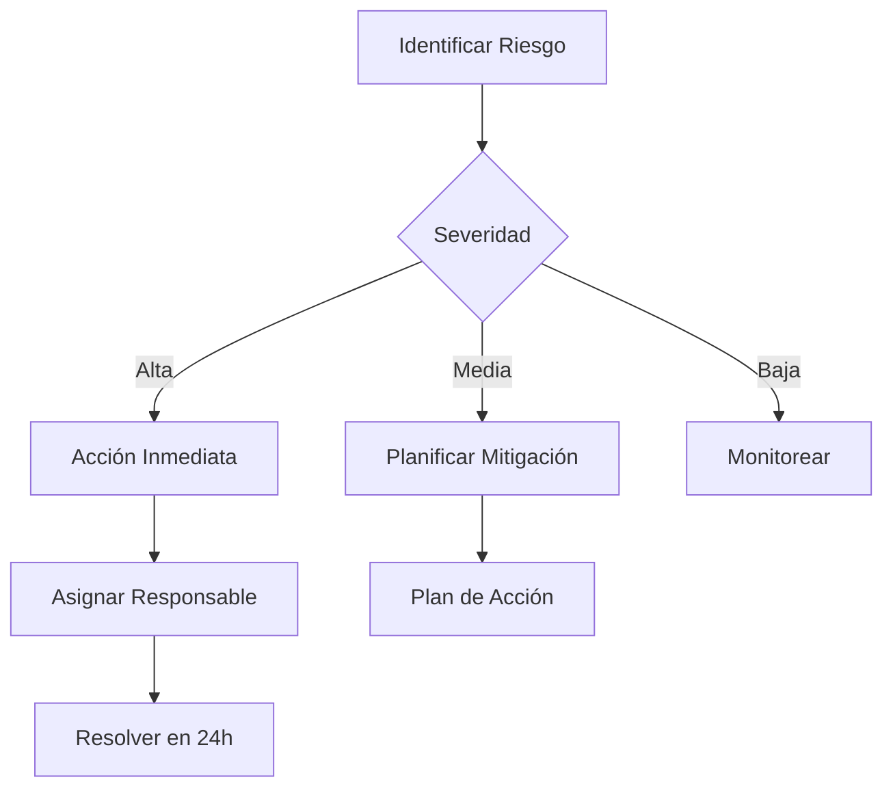

# Riesgos e Impedimentos
## Sistema de Gestión de Inventario de Bienes

---

## Matriz de Riesgos

| ID | Riesgo | Probabilidad | Impacto | Severidad | Estado | Mitigación |
|----|--------|--------------|---------|-----------|--------|------------|
| R01 | Resistencia al cambio de usuarios | Alta | Alto | ⚠️ | Vigilando | Capacitación continua, soporte dedicado |
| R02 | Datos históricos inconsistentes | Media | Alto | ⚠️ | Identificado | Proceso de validación y limpieza |
| R03 | Falta de conectividad estable | Media | Medio | ⚠️ | **Activo** | Configuración SMTP requerida |
| R04 | Configuración SMTP pendiente | Alta | Medio | ⚠️ | **Bloqueo** | Solicitar credenciales IT |
| R05 | Problemas de rendimiento con muchos datos | Media | Medio | ⚠️ | Mitigado | Índices optimizados |
| R06 | Pérdida de datos por fallas de hardware | Baja | Crítico | ✅ | Mitigado | Backups automáticos diarios |
| R07 | Impedimento: Escaneo QR sin generación | Baja | Bajo | ✅ | Resuelto parcial | HU-025 implementado sin HU-024 |

---

## Impedimentos Activos

### I01: Configuración SMTP para Notificaciones
- **Tipo:** Técnico
- **Prioridad:** Alta
- **Asignado a:** Equipo de Infraestructura IT
- **Estado:** Pendiente
- **Días bloqueado:** 14 días
- **Acción requerida:** Proporcionar credenciales de correo institucional

### I02: Importación Excel - Dependencia de librería
- **Tipo:** Técnica
- **Prioridad:** Media
- **Asignado a:** Backend
- **Estado:** En progreso
- **Acción requerida:** Instalar maatwebsite/excel

---

## Impedimentos Resueltos

| ID | Impedimento | Resolución | Fecha |
|----|-------------|------------|-------|
| I001 | Login bucle de redirección | Middleware corregido | Nov 2025 |
| I002 | QR escaneo sin generación | Implementado escaneo (HU-025) | Dic 2025 |

---

## Plan de Mitigación



---

## Registro de Impedimentos Diarios

### Template para Daily

```markdown
**Impedimento:** [Descripción breve]
**Tipo:** Técnico / Requerimiento / Desconocimiento
**Bloqueo:** Sí/No
**Días acumulados:** [número]
**Responsable escalado:** [nombre]
**Acción correctiva:** [qué se hará]
```

---

## Escalamiento

| Nivel | Responsable | Tiempo Respuesta |
|-------|-------------|------------------|
| 1 | Scrum Master | Inmediato |
| 2 | Product Owner | 2 horas |
| 3 | Gerencia Técnica | 24 horas |
| 4 | Dirección | 48 horas |